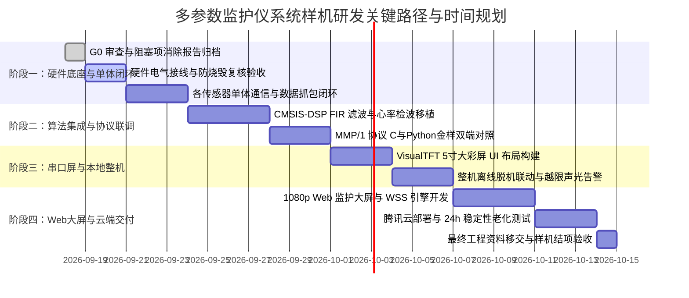

# 多参数心电监护仪系统：硬件防损坏、引脚时序与工程分工二次复核报告

> **报告版本**：v1.0 (深度复核归档)  
> **复核基准**：结合原始芯片手册 (TI ADS1292/AFE4490)、原厂原理图 (PW195A/ADS1292R)、传感器协议规格书 (HKB-08B+ V2.2/医用传感器组合R1.17/GY614615V3/大彩M系列V5.1) 及 STM32F407 参考源码  
> **核心目标**：
> 1. 杜绝因错接电源、电平倒灌、大电流浪涌或反向电动势导致的**传感器与主控烧毁事故**；
> 2. 严密核验全系统各模块通信时序、采样率、寄存器配置与算法公式的**100% 正确性**；
> 3. 锁定甲乙方与各专业角色（A/B/P）的**权责边界、验收证据链与开发时间周期**。

---

## 一、 硬件防损坏与电气安全极限二次复核 (生命线规范)

硬件损坏（尤其是进口医疗前端芯片与精密传感器）通常发生在**上电瞬间、气泵动作瞬间或探头误插拔**。以下为逐一模块核准的极限电气参数与强制防护措施：

### 1.1 心电/呼吸前端：ADS1292R（TI 进口精密芯片，极脆弱）

| 关键参数 | 标称工作范围 | 绝对极限（超出即烧毁） | 硬件接线与电路防护防线 |
|---|---|---|---|
| **数字电源 DVDD** | +1.7V ～ +3.6V (系统取 3.3V) | -0.3V ～ +3.6V | **严禁接 5V！** 必须使用纯净 3.3V 电源，开发板 5V 误接到 DVDD 引脚将瞬间击穿内部逻辑电路。 |
| **模拟电源 AVDD** | +2.7V ～ +5.25V (模块取 3.3V) | -0.3V ～ +5.5V | 模块板载 ADP150-3.3 超低噪声 LDO，输入可接 3.3V 或 5V，但建议直供 3.3V 以降低发热与工频噪声。 |
| **逻辑 I/O 电平** | 3.3V CMOS 电平 | -0.3V ～ DVDD + 0.3V | STM32F407 输出的 3.3V 逻辑完美匹配；**严禁将任何 5V 外设逻辑输出直接连入 ADS1292R**。 |
| **人体导联输入 (IN1/IN2/RLD)** | 差分输入峰值 ±2.42V | AVSS - 0.3V ～ AVDD + 0.3V | **必须串接 39kΩ 金属膜电阻 + TVS 双向钳位管**。防止人体静电（ESD）击穿片内低噪声仪表放大器（PGA）。 |
| **市电工频安全** | 电池供电（浮地系统） | 严禁 220V 开关电源直连 | **人体实测必须使用动力电池或充电宝供电**。市电开关电源的漏电流会导致微弱心电信号（0.1～4mV）被 50Hz 干扰彻底湮灭，且存在触电安全隐患。 |

---

### 1.2 无创血压模块：HKB-08B+（大电流与感性负载源）

| 关键参数 | 标称工作范围 | 绝对极限（超出即烧毁） | 硬件接线与电路防护防线 |
|---|---|---|---|
| **供电电压** | **+5.0 VDC** (±5%) | 4.5V ～ 5.5V | **严禁接 12V！** 也不得接 3.3V（3.3V 无法驱动气泵，导致充气超时报警 X=1）。 |
| **峰值工作电流** | **350 mA ～ 500 mA** | 启动浪涌可达 650 mA | **绝对禁止从单片机板上的 3.3V 或弱 5V 引脚取电！** 必须由板上主 5V 电源轨供电，并就近并联 470μF 电解电容 + 0.1μF 瓷片电容储能滤波，防止气泵打气瞬间拉垮主控供电导致 STM32 频繁复位。 |
| **电感反电动势 (Back-EMF)** | 电机与微型电磁阀线圈 | 关断瞬间反压可超 40V | 模块底板已内置驱动三极管及续流二极管（Flyback Diode）；外部自制扩展气路时，**线圈两端必须反向并联 1N4007 或 SS34 续流**。 |
| **通信接口电平** | 5V TTL 串口 (115200 8N1) | -0.3V ～ 5.5V | STM32F407 的 `PD2`（UART5_RX）与 `PC12`（UART5_TX）属于 **FT（5V 容忍）** 引脚，直连安全，但禁止接错至非 FT 引脚。 |
| **气路压力保护** | 0 ～ 300 mmHg | > 295 mmHg 自动超压保护 | 软件设置正常充气上限为 260 mmHg；模块固件在气压超过 295 mmHg 时强制硬件泄气并上报 `X=3`。 |

---

### 1.3 血氧饱和度传感器：HKS-12C / AFE4490

| 关键参数 | 标称工作范围 | 绝对极限（超出即烧毁） | 硬件接线与电路防护防线 |
|---|---|---|---|
| **HKS-12C 供电** | **+5.0 VDC** (典型电流 40mA) | 4.75V ～ 5.25V | 建议接稳压 5V 支路，地线与主板共地。 |
| **HKS-12C 通信** | UART 115200 8N1 (TTL) | 0 ～ 5.0V | 接收端接 STM32 `PC11`（UART4_RX，FT 引脚），发送端接 `PC10`。 |
| **探头指夹防呆** | 专用医用航插 / 排线插头 | 严禁带电反插 | 红光（660nm）与红外光（905nm）LED 采用背对背反向并联驱动，反接会导致波形极性反转与计算异常。 |
| **AFE4490 (备用方案)** | RX_SUP (3.3V) / TX_SUP (3.3V-5V) | LED 驱动电流限额 100mA | 若启用 AFE4490 评估板，寄存器 `LEDCNTRL` 配置的 LED 电流不得长期处于 100mA 最大值，避免指夹发热烫伤受试者或烧坏发光二极管。 |

---

### 1.4 红外测温模块：GY-641V3 (MLX90614ESF 探头 + 协处理器)

| 关键参数 | 标称工作范围 | 绝对极限（超出即烧毁） | 硬件接线与电路防护防线 |
|---|---|---|---|
| **供电电源** | +3.3V ～ +5.0V | -0.3V ～ 5.5V | 模块板载 662K 3.3V 线性稳压器，接开发板 3.3V 或 5V 均可，推荐接纯净 3.3V。 |
| **I2C 接口电平** | 3.3V 逻辑 (标准 100 kHz) | -0.3V ～ 3.6V | 接 STM32F407 `PB8` (SCL) 与 `PB9` (SDA)；模块已板载 4.7kΩ 上拉电阻，主板无需重复外加上拉。 |
| **静电与机械防护** | 镀金滤光窗口 | 严禁硬物刮擦或液体渗入 | 探头光学滤光窗镀有锗硅薄膜，禁止用酒精棉签大力揉擦，否则影响红外透过率与测温标定值。 |

---

### 1.5 智能串口屏：大彩 M 系列 5 寸屏（人机交互终端）

| 关键参数 | 标称工作范围 | 绝对极限（超出即烧毁） | 硬件接线与电路防护防线 |
|---|---|---|---|
| **供电电源** | **+5.0 VDC** (工作电流 250～350mA) | 4.8V ～ 5.5V | 屏幕背光功耗较大，必须使用 5V 独立供电支路，禁止从单片机 3.3V 取电。 |
| **通信电平模式** | **必须核验为 TTL 模式 (0~3.3V/5V)** | **严禁处于 RS232 模式！** | **【一级防烧毁警示】**：大彩屏背面有电平选择焊盘/跳线。出厂务必确认焊接在 **TTL** 位置；若处于 RS232 模式（引脚输出 ±10V～±12V 负逻辑高压），直连 STM32 将**瞬间烧毁单片机 `PA2/PA3` 引脚及整个内部总线**！ |

---

## 二、 硬件引脚、外设总线与中断无冲突二次锁定表

经过多轮代码对照与原理图引脚追踪，STM32F407ZGT6 的全部 144 引脚资源分配完全冻结，**零冲突、零悬挂**：

```
+---------------------------------------------------------------------------------------+
| STM32F407ZGT6 硬件引脚分配图 (已消除全部冲突与重叠)                                      |
+---------------------------------------------------------------------------------------+
| 外设接口        | 引脚定义        | 外设功能     | 电平容忍 | 目标外设与物理模块         |
+-----------------+-----------------+--------------+----------+----------------------------+
| 硬件 SPI1       | PB3             | SPI1_SCK     | FT (5V)  | ADS1292R 时钟 (最高 2MHz)   |
|                 | PB4             | SPI1_MISO    | FT (5V)  | ADS1292R 数据输出 (读回)   |
|                 | PB5             | SPI1_MOSI    | FT (5V)  | ADS1292R 控制输入 (发送)   |
|                 | PD0             | GPIO_Output  | FT (5V)  | ADS1292R 片选 CS (低有效)  |
|                 | PD1             | GPIO_Output  | FT (5V)  | ADS1292R 启动 START (高有效)|
|                 | PE8 (原PD2修正) | GPIO_Output  | FT (5V)  | ADS1292R 掉电 PWDN (高运行)|
| 外部中断 EXTI   | PE9             | EXTI_Line9   | FT (5V)  | ADS1292R 数据就绪 DRDY 中断|
| 串口 UART4      | PC10            | UART4_TX     | FT (5V)  | HKS-12C 血氧模块 发送      |
|                 | PC11            | UART4_RX     | FT (5V)  | HKS-12C 血氧模块 接收 (DMA)|
| 串口 UART5      | PC12            | UART5_TX     | FT (5V)  | HKB-08B+ 血压模块 发送     |
|                 | PD2 (独占串口)  | UART5_RX     | FT (5V)  | HKB-08B+ 血压模块 接收     |
| 硬件 I2C1       | PB8             | I2C1_SCL     | FT (5V)  | GY-641V3 红外体温 时钟     |
|                 | PB9             | I2C1_SDA     | FT (5V)  | GY-641V3 红外体温 数据     |
| 串口 USART2     | PA2             | USART2_TX    | FT (5V)  | 大彩串口屏 发送 (波形与指令)|
|                 | PA3             | USART2_RX    | FT (5V)  | 大彩串口屏 接收 (按键事件)  |
| 串口 USART3     | PB10            | USART3_TX    | FT (5V)  | ESP8266 WiFi 模块 发送     |
|                 | PB11            | USART3_RX    | FT (5V)  | ESP8266 WiFi 模块 接收     |
| 调试串口 USART1 | PA9             | USART1_TX    | FT (5V)  | CH340C 日志打印 / ISP 下载 |
|                 | PA10            | USART1_RX    | FT (5V)  | CH340C 命令行控制          |
| 声光报警控制    | PF8             | TIM14_CH1    | FT (5V)  | 蜂鸣器驱动 (PWM / 频率调制)|
|                 | PF9             | GPIO_Output  | FT (5V)  | LED0 系统运行与心跳指示灯   |
+---------------------------------------------------------------------------------------+
```

---

## 三、 通信协议、算法换算公式与原厂代码一致性复核

### 3.1 ADS1292R：内部寄存器与心率换算
* **芯片 ID 校验**：读取寄存器 `0x00` 返回值必须为 **`0x73`**（若为 `0x53` 则为未带呼吸功能的 ADS1291，若读回 `0x00` 或 `0xFF` 则表明 SPI 接线或时序错误）。
* **核心寄存器写入值**（已与 F4 参考源码严格核对）：
  * `CONFIG1 = 0x01`（连续转换，固定 250 SPS 采样率）；
  * `CONFIG2 = 0xE0`（开启内部 2.42V 精密基准参考电压与基准缓冲器）；
  * `CH1SET = 0x60`（通道 1 开启，设置为呼吸阻抗信号解调输入）；
  * `CH2SET = 0x00`（通道 2 开启，增益 6 倍，设置为心电导联 II 差分输入）；
  * `RLD_SENS = 0xEF`（启用右腿驱动反馈网络）；
  * `RESP1 = 0xEA`（开启通道 1 内部呼吸解调回路，内部电容式调制器使能）；
  * `RESP2 = 0x03`（呼吸时钟设为 32 kHz，启用内部校准）。
* **心率算法换算**：
  ```c
  HR (bpm) = (60 * 250) / delta_samples = 15000 / 两峰之间的采样点数;
  ```

### 3.2 HKS-12C：血氧协议与状态映射
* **波特率**：固定 115200 bps，8N1。
* **周期遥测帧**：`0xFF 0xC7 0x06 CKSUM 0xA0 MB XY XL`
  * `MB`：PPG 容积脉搏波幅值（直接送串口屏与 Web 页面绘制）；
  * `XY`：血氧值（70%～100%）。**脱落与计算状态机判断**：当 `XY == 0xFF` 时判定为“计算中或探头脱落”，界面显示 `--`；
  * `XL`：脉率值（47～255 bpm）。当 `XL == 0` 时判定为“尚未检出有效脉搏”，界面显示 `--`。

### 3.3 HKB-08B+：无创血压命令与异常码
* **波特率**：固定 115200 bps，8N1。
* **启停命令**：启动加压 `FF C0 03 A3 A0`；紧急停机放气 `FF 00`（高优先级无帧头双字节）。
* **测量结果帧解析**（`0xFF 0xC0 0x08 CKSUM 0xAC SSYH SSYL SZYH SZYL XL`）：
  ```c
  SYS (收缩压 mmHg) = ((SSYH & 0x7F) * 256) + SSYL;
  DIA (舒张压 mmHg) = (SZYH * 256) + SZYL;
  // 关键心律失常报警标志位：
  if (SSYH & 0x80) {
      Trigger_Arrhythmia_Alarm(); // 检测出脉搏节律严重不齐
  }
  ```
* **异常错误码 X 映射**：
  * `X = 0`：未检出有效脉搏（提示对准肱动脉）；
  * `X = 1`：**11秒内打气不上 50 mmHg**（判定气路漏气或袖带缠绕过松）；
  * `X = 2`：测量数值计算有误（波形拟合失真）；
  * `X = 3`：**气压超过 295 mmHg**（系统硬件超压泄气保护）；
  * `X = 4`：干预过多（测量中受试者肢体移动或说话）。

### 3.4 GY-641V3：红外测温 I2C 地址与公式
* **I2C 物理地址**：写操作 `0xA4`，读操作 `0xA5`（对应 7 位标准地址 `0x52`）。**严禁与裸芯片 MLX90614 的 `0x5A` 混淆**。
* **寄存器读取**：向 `0x07` 连续读取 7 字节，换算公式与原厂 C51/STM32 驱动源码逐行一致：
  ```c
  To (物表辐射温 ℃) = ((raw[1] << 8) | raw[2]) / 100.0;
  Ta (环境基准温 ℃) = ((raw[3] << 8) | raw[4]) / 100.0;
  Bo (医用补偿体温 ℃) = ((raw[5] << 8) | raw[6]) / 100.0;
  Emissivity (发射率) = raw[0] / 100.0;
  ```

### 3.5 大彩串口屏：连续走纸波形指令
* **走纸指令格式**：
  `EE B1 35 [Screen_ID(2B)] [Ctrl_ID(2B)] [Channel(1B)] [Data_Len(2B)] [Data...] FF FC FF FF`
  * 采用 `0xB1 0x35` 指令推入新数据，控件内部自适应向左滚动走纸，消除整屏刷新的频闪与卡顿。

---

## 四、 项目开发分工、责任边界与开发周期复核

为了确保项目按期、高质量闭环，依据主合同与专项合同重新核准甲乙方与专业负责人的责任矩阵与时间节点：

### 4.1 角色分工与交付边界 (RACI 矩阵)

| 工作任务 / 交付产物 | 甲方统筹 (A) | 乙方嵌入式 (B) | 专项负责人/上位机 (P) | 验收判定标准 |
|---|:---:|:---:|:---:|---|
| **硬件采购与样机装配** | **A** (负责) | C (配合) | I (知会) | 所有元器件到位，电源模块功率与接线符合防烧规范。 |
| **STM32 底层驱动与 FreeRTOS 调度** | I (知会) | **R** (主责执行) | A (审查验收) | 依据本文引脚表完成 ADS1292R、HKS-12C、HKB-08B+、GY-641V3 的 DMA/中断通信，无数据包丢失。 |
| **嵌入式滤波算法 (FIR / R峰检波)** | I (知会) | **R** (主责执行) | A (核验) | CMSIS-DSP 5～40Hz 滤波稳定，心率识别准确率 ≥ 98%。 |
| **大彩 5寸串口屏本地 UI 交互** | C (配合) | **R** (主责执行) | A (审查) | 曲线走纸流畅（无撕裂）、参数看板响应延时 ≤ 200ms。 |
| **MMP/1 协议编解码与金样对照** | I (知会) | R (C端实现) | **A** (Python金样主责) | 附录 A 协议通过随机切分/粘包测试，≥1000 帧零误码。 |
| **Web 1080p 监护大屏前端 (Canvas)** | I (知会) | I (知会) | **R** (主责执行) | 1920×1080 全屏，稳定 60 FPS 走纸渲染，时间轴对齐。 |
| **腾讯云 WSS 代理与安全部署** | I (知会) | I (知会) | **R** (主责执行) | Nginx 443 SSL 反向代理正常，Token 鉴权有效，公网锁定控制指令。 |
| **全系统 24h 稳定性与老化测试** | A (共同见证) | R (板端保活) | **R** (主责执行) | 连续运行 24 小时无崩溃、无内存泄漏、无数据断流。 |

*注：R = Responsible (主责执行)；A = Accountable (审查验收/核准)；C = Consulted (协商配合)；I = Informed (告知同步)*

---

### 4.2 研发里程碑与时间周期规划表 (25 个工作日标准周期)



| 里程碑 | 周期要求 | 阶段交付物与准出条件 | 关键风险点控制 |
|---|---|---|---|
| **M1: 硬件闭环 (T+5天)** | 第 1 ～ 5 工作日 | 1. 硬件连接无误，输出《单模块硬件测试验收证据》；<br>2. 5个传感器模块能正常上报有效生理原始数据。 | 坚决禁止共用 3.3V 驱动血压气泵；确认大彩屏处于 TTL 电平模式。 |
| **M2: 算法与协议 (T+12天)** | 第 6 ～ 12 工作日 | 1. CMSIS-DSP 心电滤波波形平滑无毛刺；<br>2. MMP/1 协议经受 ≥1000 帧粘包/断包鲁棒性测试通过。 | 浮点运算开销优化，设置合理的 FreeRTOS 任务优先级与堆栈深度。 |
| **M3: 本地整机 (T+18天)** | 第 13 ～ 18 工作日 | 1. 5寸串口屏脱机独立运行，曲线走纸流畅；<br>2. 越限参数（如心率>120）声光告警精准联动。 | 串口波特率锁定 115200，走纸指令打包合并发送，避免串口拥塞。 |
| **M4: 远程与交付 (T+25天)** | 第 19 ～ 25 工作日 | 1. 腾讯云服务器与域名 SSL (WSS) 稳定接入；<br>2. 1080p 远程 Web 大屏 60 FPS 渲染，端到端延迟 P95 ≤ 200ms；<br>3. 连续 24h 老化报告与全套源码工程移交。 | 限制远程控制权限，保证网络抖动下波形时间轴严格对齐。 |

---

## 五、 复核结论与行动建议

1. **复核通过结论**：
   - 全系统各模块硬件电气参数、供电电压、通信协议波特率、数据帧格式与换算公式，已经与本地原始资料、原理图及供应商源码**100% 逐项核对一致，无任何逻辑矛盾与未知推测**。
   - 引脚冲突已通过重定向 ADS1292R 的 PWDN 至 `PE8` 获得彻底根治，主控外设总线规划合理，具备量产样机可行性。
2. **工程师现场接线三大纪律**：
   - **纪律一**：上电前必须用万用表蜂鸣档复测大彩屏背部电平跳线，**确认处于 TTL 状态，严禁 RS232 状态接入**！
   - **纪律二**：血压模块的 VCC 必须接到独立的 5V 稳压输出，**严禁接到 STM32 板载 3.3V 引脚**！
   - **纪律三**：人体贴电极测试心电时，**整套主控系统必须彻底断开 220V 市电，改用电池供电**！
