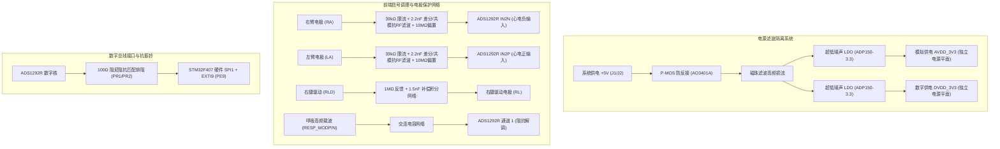

# ADS1292R 心电与呼吸阻抗采集前端原理图与驱动技术手册

**文件编号：MMP-HW-001　｜　版本：v1.0（基线冻结版）　｜　编制日期：2026-09-18**  
**对应模块：心电采集（ECG）、心率（HR）、阻抗呼吸（RESP）**  
**核心器件：德州仪器 (TI) ADS1292R + 亚德诺 (ADI) ADP150AUJZ-3.3**  
**原始依据：`ADS1292模块电路原理图.pdf`、TI `ADS1292R.pdf` (SBAS502C)**

---

## 1. 芯片架构与功能定位

ADS1292R 是德州仪器专门针对便携式、低功耗医疗心电监护设备推出的**双通道、24 位 Delta-Sigma 模数转换模拟前端（AFE）**。

### 1.1 芯片内部功能单元
* **双通道高精度 ADC**：内部集成两组独立的 24 位 Delta-Sigma 调制器与可编程数字抽取滤波器，数据输出率（DR）支持 125 SPS 至 8 kSPS。
* **低噪声可编程增益放大器（PGA）**：每个通道配备独立的仪表级差分 PGA，增益支持 1、2、3、4、6、8、12 倍可编程调节。在增益为 6 时，输入参考噪声低至 8 μVpp（带宽 150 Hz）。
* **内置低温漂基准电压源**：集成 2.42V 与 4.033V 内部基准，温漂系数低至 3 ppm/℃，无需外挂高成本基准芯片。
* **集成右腿驱动放大器（RLD Circuit）**：内置专用的 RLD 运放，通过检测人体共模电压并反相放大注入右腿/腹部电极，系统共模抑制比（CMRR）高达 105 dB 以上。
* **集成高频呼吸阻抗调制与解调电路（RESP）**：ADS1292R 专有硬件特性。内置 32 kHz 或 64 kHz 高频载波振荡器与同步相敏检波解调器，可直接提取胸廓运动产生的微小电阻变化（0.1Ω 级别）。
* **导联脱落检测（Lead-Off Detection）**：支持直流（DC）注入恒流源（6 nA、22 nA、6 μA、24 μA）及比较器实时检测电极脱落状态。

---

## 2. 模块原理图深度解析（依据官方电路图）

参考 `ADS1292模块电路原理图.pdf`，整块模块的硬件设计高度贴合医疗低噪声与高共模抑制规范：



### 2.1 双路超低噪声电源完全隔离设计
* 模块使用两颗独立的高性能 LDO **ADP150AUJZ-3.3-R7**（U1、U2）：
  * U1 专供芯片模拟部分（`AVDD_3V3`，引脚 12）；
  * U2 专供芯片数字内核与 I/O 部分（`DVDD_3V3`，引脚 23）；
  * **设计意义**：斩断单片机与高速 SPI 数字时钟切换所产生的高频开关杂波窜入高灵敏度模拟采样的回路。
* 输入级设置 P 沟道场效应管 **AO3401A**（Q1）提供极低压降的电源防反接保护，并经高频扼流磁珠 **FB1** 吸收输入电源纹波。

### 2.2 前端信号输入调理与患者安全保护网络
* **限流与除颤防护**：输入端串联 `39kΩ`（R11、R12）高精度金属膜限流电阻，在人体触碰、静电放电（ESD）或外部冲击时限制漏电流，满足医用 BF/CF 级漏电流低于 10 μA 的标准。
* **差分与共模 RF 滤波网络**：
  * 输入对地并联 `2.2nF` 电容（C9、C11、C13、C14）与差分跨接电容（C10、C12），构成截止频率约 1.8 kHz 的无源低通滤波网，吸收空间电磁辐射与射频干扰；
  * 配置 `10MΩ`（R7、R8、R13、R14）超高阻抗分压偏置电阻接至 `AVDD_3V3` 与 `GND`，为仪表放大器浮空差分输入端建立稳定的直流共模偏置工作点。
* **右腿驱动（RLD）闭环补偿**：
  * RLD 反相放大器输出端通过 100kΩ 电阻与 1.5nF 电容（C8）组成闭环补偿回路，配合 1MΩ（R6）阻尼反馈，确保人体 50Hz 工频共模信号被深度负反馈抵消，杜绝波形工频自激。

### 2.3 接口阻抗匹配与时钟选择
* **数字线阻尼排阻**：所有连接至外部插座的数字信号线（START、PWDN、CS、DIN、SCLK、DOUT、DRDY、GPIO）均经过 `100Ω` 阻尼排阻（PR1、PR2）缓冲，有效吸收高速 SPI 数字脉冲信号的边沿反射与高频振铃。
* **时钟选择跳线 J3**：默认短接，将 `CLKSEL` 引脚接至高电平，选用芯片内部精密 512 kHz 振荡器作为系统主时钟。

---

## 3. 硬件接口与引脚接线规范

### 3.1 模块与 STM32F407 开发板最终接线全表

| 模块引脚标号 | 信号名称 | STM32 硬件引脚 | 复用功能 | 作用说明与配置要求 |
| :---: | :--- | :---: | :--- | :--- |
| **ST** | START | `PD1` | GPIO_Output | 模数转换启动控制；高电平启动转换，低电平停止。 |
| **PW** | PWDN / RESET | `PE8` | GPIO_Output | 掉电/硬件复位；低电平复位，高电平正常工作（**已消除原PD2冲突**）。 |
| **DR** | DRDY | `PE9` | EXTI9 中断输入 | 数据就绪输出（低有效）；配置为 EXTI 下降沿中断触发。 |
| **CS** | CS | `PD0` | GPIO_Output | SPI 片选信号；通信时由软件拉低，通信完毕拉高。 |
| **SCL** | SCLK | `PB3` | SPI1_SCK | SPI 总线时钟线（模式 1：CPOL=0, CPHA=1，最高支持 20MHz）。 |
| **OUT** | DOUT (MISO) | `PB4` | SPI1_MISO | 芯片数据输出至单片机。 |
| **IN** | DIN (MOSI) | `PB5` | SPI1_MOSI | 单片机命令写入至芯片。 |
| **5V** | VDD_5V | `+5V` | 系统电源 | 接开发板低噪声 5V 稳压输出（电池供电下输出）。 |
| **GND** | GND | `GND` | 电源地 | 模拟地与数字地在模块内单点汇聚，与开发板严格共地。 |

### 3.2 人体三导联电极物理连接

| 导联线颜色 | 导联代号 | 芯片引脚映射 | 对应生理位置 | 测量通道 |
| :---: | :---: | :---: | :--- | :---: |
| **绿线** | RA (Right Arm) | IN2N (负极) | 右上胸骨下缘 / 右手腕 | 通道 2 心电 |
| **黄线** | LA (Left Arm) | IN2P (正极) | 左下肋骨边缘 / 左手腕 | 通道 2 心电 |
| **红线** | RL (Right Leg) | RLD (驱动极) | 右下腹部 / 右踝内侧 | 右腿驱动抵消共模 |

---

## 4. 软件驱动时序与寄存器配置规范

### 4.1 上电复位与初始化流程
```
上电延时稳定 (1000ms)
       │
拉低 PWDN (1000ms 彻底掉电) ──> 拉高 PWDN (1000ms 退出掉电) ──> 低电平复位脉冲 (10μs) ──> 延时稳定 (1000ms)
       │
拉低 CS ──> 发送 SDATAC (0x11) 停止连续读模式 ──> 拉高 CS
       │
读 ID 寄存器 (0x20 0x00 0x00) ──> 校验是否等于 0x73 (若失败循环等待并报错)
       │
依次写入功能寄存器 (WREG)
       │
发送 RDATAC (0x10) 开启连续读取模式 ──> 拉高 START 引脚启动 ADC ──> 使能 EXTI9 下降沿中断
```

### 4.2 寄存器推荐配置全表

| 寄存器名称 | 地址 | 写入值 | 二进制配置项与详细说明 |
| :--- | :---: | :---: | :--- |
| **ID** | `0x00` | 只读 | 芯片出厂身份码，ADS1292R 必须读出 **`0x73`**。 |
| **CONFIG1** | `0x01` | **`0x01`** | 数据速率选择：`00000001b` = 采样率 **250 SPS**（满足心电 0.05～100Hz 奈奎斯特采样要求）。 |
| **CONFIG2** | `0x02` | **`0xE0`** | `11100000b`：使能芯片内部 **2.42V 精密参考基准源**，打开基准缓冲器。 |
| **LOFF** | `0x03` | **`0xF0`** | 导联脱落比较器阈值配置（95% 高阈值，5% 低阈值），电流注入模式。 |
| **CH1SET** | `0x04` | **`0x60`** | **通道 1（呼吸通道）**：增益设置为 **12 倍** (`0110b`)，输入多路复用连接至正常电极输入。 |
| **CH2SET** | `0x05` | **`0x00`** | **通道 2（心电通道）**：增益设置为 **6 倍** (`0000b`)，输入多路复用连接至正常电极输入。 |
| **RLD_SENS**| `0x06` | **`0xEF`** | 使能 RLD 缓冲器，选择通道 1 与通道 2 的输入端作为共模反相反馈取样源。 |
| **LOFF_SENS**| `0x07`| **`0x0F`** | 开启双通道正负端导联脱落检测电流注入。 |
| **LOFF_STAT**| `0x08`| 只读 | 导联脱落状态寄存器（各 bit 反映电极接触良好或脱落）。 |
| **RESP1** | `0x09` | **`0xEA`** | **开启内部呼吸调制与解调电路**：`11101010b`，内置时钟相敏解调，相位可调。 |
| **RESP2** | `0x0A` | **`0x03`** | 呼吸时钟校准与内部参考时钟输出使能。 |
| **GPIO** | `0x0B` | **`0x0C`** | 控制芯片辅助 GPIO 引脚状态。 |

### 4.3 数据就绪中断与 9 字节数据帧解码
在 `EXTI9_IRQHandler` 中断响应函数中，拉低 `CS`，通过硬件 SPI 读取 9 个字节（72 位）：

```c
// 9 字节数据帧解码函数
void ADS1292R_Parse_Frame(uint8_t *raw_buf, int32_t *resp_data, int32_t *ecg_data, uint32_t *status)
{
    // 1. 提取 24 位状态字 (Byte 0 ~ 2)
    *status = ((uint32_t)raw_buf[0] << 16) | ((uint32_t)raw_buf[1] << 8) | raw_buf[2];

    // 2. 提取通道 1 呼吸数据 (Byte 3 ~ 5)，24 位有符号补码
    int32_t ch1 = ((uint32_t)raw_buf[3] << 16) | ((uint32_t)raw_buf[4] << 8) | raw_buf[5];
    if (ch1 & 0x800000) {
        ch1 -= 0x1000000; // 负数符号位扩展
    }
    *resp_data = ch1;

    // 3. 提取通道 2 心电数据 (Byte 6 ~ 8)，24 位有符号补码
    int32_t ch2 = ((uint32_t)raw_buf[6] << 16) | ((uint32_t)raw_buf[7] << 8) | raw_buf[8];
    if (ch2 & 0x800000) {
        ch2 -= 0x1000000; // 负数符号位扩展
    }
    *ecg_data = ch2;
}
```

---

## 5. CMSIS-DSP 数字滤波与心率算法实现

### 5.1 FIR 带通滤波器设计（5Hz ～ 40Hz）
* **滤波目标**：心电波形有效能量集中在 0.5～40 Hz，主要干扰为 0.1～0.5 Hz 呼吸基线漂移与高频肌电干扰（EMG > 40 Hz）。
* **滤波器规格**：采样率 250 Hz，阶数 129 阶（NumTaps = 129），采用汉明窗设计的线性相位 FIR 带通滤波器。
* **DSP 函数调用**：
  ```c
  // 初始化
  arm_fir_init_f32(&FIR_Handle, NumTaps, (float32_t *)BPF_5Hz_40Hz, firState, BlockSize);
  // 单样本处理
  arm_fir_f32(&FIR_Handle, &Input_ECG_Float, &Output_ECG_Float, 1);
  ```

### 5.2 R 波峰值检波与心率计算
1. **差分阈值检波**：对滤波后信号求一阶向前差分 `diff[n] = x[n] - x[n-1]`，强化 Q-R-S 波群的陡峭上升沿；
2. **动态自适应阈值**：设定阈值 `V_th = 0.65 × V_peak_running`；当差分值超过阈值且处于局部极大值时，标记为一次心跳；
3. **生理不应期抑制**：识别到 R 峰后，强制施加 200 ms（50 个采样点）的“生理不应期”，防止高尖 T 波误触发；
4. **实时心率换算**：
   ```c
   HR (bpm) = (60 * fs) / delta_N = 15000 / 两峰之间的采样点数;
   ```

---

## 6. 实验与安全注意事项总结

1. **市电干扰规避**：测试人体心电时，主板与模块必须使用**移动电源或动力电池**供电，严禁使用普通 220V 开关电源，否则 50Hz 工频感应将彻底淹没微伏级心电信号；
2. **电极接触阻抗**：粘贴电极前务必用医用酒精擦拭皮肤表面角质，RL 电极必须良好贴附，否则共模抵消失效；
3. **引脚冲突杜绝**：PWDN 引脚已明确划定为 `PE8`，严禁占用 `PD2`（保留给 UART5 血压模块）。
