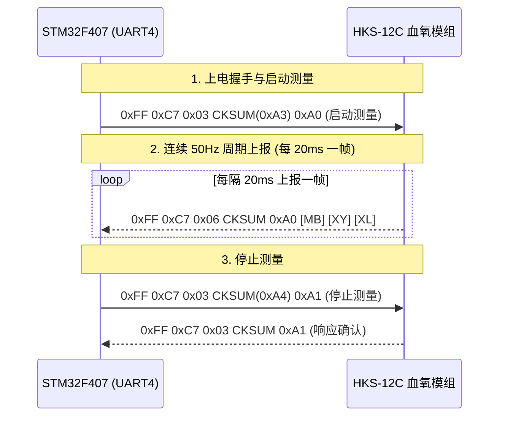

# AFE4490 与 HKS-12C 血氧饱和度传感器对比与协议技术手册

**文件编号：MMP-HW-002　｜　版本：v1.0（基线冻结版）　｜　编制日期：2026-09-18**  
**对应模块：血氧饱和度监测（SpO2）、脉率监测（PR）、光电容积脉搏波（PPG）**  
**核心器件/方案：德州仪器 (TI) AFE4490 芯片 / 合肥华科 HKS-12C 智能血氧模组**  
**原始依据：TI `afe4490-datasheet.pdf`、`血氧/使用教程.md`、`医用传感器组合模块R1.17.pdf`**

---

## 1. 方案背景与合同阻塞项 E02 澄清

在立项初期的资料核对中发现，项目资料同时出现了 **TI AFE4490**（带 Arduino 盾板及开源库）与 **华科 HKS-12C**（医疗串口成品传感器）两种截然不同的方案：

| 对比维度 | TI AFE4490 方案 | 华科 HKS-12C 方案 |
| :--- | :--- | :--- |
| **产品形态** | 纯模拟前端（AFE）集成芯片 / Arduino 扩展板 | 带微处理器（MCU）与标定固件的智能模组 |
| **电气接口** | 硬件 SPI 接口（SCLK、MOSI、MISO、CS、ADC_RDY） | 标准异步串口 UART TTL（TX、RX、5V、GND） |
| **波特率 / 速率** | SPI 模式最高 8 MHz | 串口固定 115200 bps，8N1 |
| **主控算力负担** | **极高**：STM32 需精确配置 LED 发光时序、环境光消除采样、红光/红外光交替 TIA 增益，并移植运行峰值检波与 R 值查表算法 | **极低**：模组内部 MCU 自带出厂校准算法，以 50Hz 周期直接输出脉搏波幅值、血氧百分比与脉率 |
| **样机推荐定位** | **科研探索与底层算法移植备选方案** | **首版工程样机基准方案（推荐优先落地）** |

---

## 2. 测量生理物理机理：双波长光电容积脉搏波（PPG）

两种方案均基于朗伯-比尔定律（Beer-Lambert Law）与外周毛细血管充盈脉动吸收特性：

1. **光波长选择**：
   * **红光（中心波长 660 nm）**：还原血红蛋白（`Hb`）吸收率极高，氧合血红蛋白（`HbO2`）吸收率较低；
   * **近红外光（中心波长 905/940 nm）**：氧合血红蛋白（`HbO2`）吸收率较高，还原血红蛋白（`Hb`）吸收率较低；
2. **信号分解**：透射光经光电二极管检测后分解为：
   * **直流分量（DC）**：由骨骼、肌肉、静脉血和恒定组织光衰减引起；
   * **交流分量（AC）**：由动脉血管随心脏搏动舒缩带来的周期性容积变化引起。
3. **血氧换算与标定**：
   ```
   吸光度比值 R = (AC_660 / DC_660) / (AC_940 / DC_940)
   SpO2 (%) = a - b * R   (由原厂临床对比血气分析标定曲线生成)
   ```

---

## 3. 方案一：HKS-12C 智能串口血氧模块通信协议规范（基准方案）

依据《医用传感器组合模块技术规格书 R1.17》第 7.3.11 节，HKS-12C 为标准 TTL 串口通信，波特率 115200 bps，供电 5V DC。

### 3.1 硬件引脚接线
* `VCC` -> 开发板 **+5V**（独立低纹波电源）
* `GND` -> 开发板 **GND**
* `TXD` -> STM32 **`PC11`** (UART4_RX)
* `RXD` -> STM32 **`PC10`** (UART4_TX)

### 3.2 通信数据帧与控制命令表



#### 1. 启动测量指令
* **单片机发送**：`0xFF 0xC7 0x03 CKSUM 0xA0`
  * `0xFF`：固定帧头；
  * `0xC7`：血氧模块设备识别码（Device ID）；
  * `0x03`：后续字节长度（长度 1B + 校验和 1B + 命令 1B）；
  * `CKSUM`：原厂累加校验和，公式 `(0x03 + 0xA0) & 0xFF = 0xA3`（注：历史笔记中偶现的 `0xCD` 经考证为混淆了 HKB-08B 血压设备码，驱动中严禁硬编码静态 `0xCD`，详见《关键技术疑点攻关与架构设计纠偏报告》）；
  * `0xA0`：启动采集控制码。

#### 2. 50Hz 连续体征数据上报帧
* **模块每 20 ms 主动推送**：`0xFF 0xC7 0x06 CKSUM 0xA0 MB XY XL`
  * `0xFF`：帧头；
  * `0xC7`：血氧设备类别码；
  * `0x06`：数据包长度字段；
  * `CKSUM`：低字节累加和 `(0x06 + 0xA0 + MB + XY + XL) & 0xFF`；
  * `0xA0`：当前状态为测量中；
  * **`MB`（Byte 5）**：**血容积脉搏波幅值（PPG Waveform）**，无量纲相对量（0～255）。单片机可直接压入环形缓冲，送大彩串口屏以 `0xB1 0x35` 指令平滑走纸绘制脉搏波；
  * **`XY`（Byte 6）**：**血氧饱和度百分比（SpO2）**，单位 %。正常人体范围为 95%～99%，允许测量范围为 70%～100%。**若当前值为 `0xFF`，代表手指未插好、光强搜索中或弱灌注无效状态**；
  * **`XL`（Byte 7）**：**脉率数值（PR）**，单位 bpm，量程 47～255 bpm。**若当前值为 `0`，代表正在统计周期或未检出稳定脉搏**。

#### 3. 停止测量指令
* **单片机发送**：`0xFF 0xC7 0x03 CKSUM 0xA1`（校验和 `(0x03 + 0xA1) & 0xFF = 0xA4`）。

---

## 4. 方案二：TI AFE4490 芯片与 Arduino 扩展板解析（算法备选）

依据 TI 官方 `afe4490-datasheet.pdf` 与开源驱动库 `AFE4490_library`，AFE4490 适用于完全自主掌控光电前端时序与算法的研发场景。

### 4.1 AFE4490 内部核心架构
* **可编程发射控制（Tx）**：集成两个独立的 8 位电流数模转换器（LED DAC），驱动电流可编程范围 0 ～ 50 mA，精确控制红光与红外光 LED 的交替发光占空比。
* **低噪声接收通道（Rx）**：
  * 集成跨阻放大器（TIA），反馈电阻 `Rf` 500Ω 至 1MΩ 可编程，反馈电容 `Cf` 5pF 至 50pF 可编程；
  * 二阶低通滤波与可编程增益环境光扣除（Ambient Light Cancellation）模拟电路，可衰减高达 100 μA 的外界环境日光或日光灯干扰；
  * 22 位 Delta-Sigma 高精度 ADC，采样率最高可达 1 kHz。

### 4.2 硬件引脚与 SPI 接口
* `AFE_CS`：SPI 片选（低有效）；
* `AFE_SCLK`：SPI 时钟（Mode 0，最高 8MHz）；
* `AFE_MOSI` / `AFE_MISO`：SPI 主出/主入；
* `AFE_ADC_RDY`：ADC 数据转换完成中断引脚；
* `AFE_PDN`：硬件低功耗掉电引脚。

### 4.3 驱动库核心源码逻辑（参考 `AFE4490_library/src`）
1. **时序状态机配置**：通过配置 `LED2STC`、`LED2ENDC`、`LED1STC`、`LED1ENDC`、`ADCRSTCNT0` 等寄存器，划分出一个采样周期内的四个时序时隙：
   * 时隙 1：开启红光 LED，采集 `LED1` 信号；
   * 时隙 2：关闭 LED，采集红光环境光参考分量 `ALED1`；
   * 时隙 3：开启红外光 LED，采集 `LED2` 信号；
   * 时隙 4：关闭 LED，采集红外环境光参考分量 `ALED2`。
2. **净光电容积信号计算**：
   ```c
   RED_pure = LED1 - ALED1;
   IR_pure  = LED2 - ALED2;
   ```
3. **算法库（`S_spo2_algorithm.cpp`）**：对两路纯净信号进行滑动均值滤波分离 DC，运行峰峰值检波获得 AC，计算 `R` 值并代入标定多项式得到 SpO2。

---

## 5. 工程选型结论与软件接入策略

1. **样机第一阶段（必交付基线）**：
   * 采用 **HKS-12C 串口方案**，连接至 STM32F407 的 `UART4`（`PC10/PC11`），启用串口 DMA 接收与空闲中断（IDLE）；
   * 建立超时与探头脱落保护：若连续 3 秒接收到 `XY = 0xFF` 或未收到数据，状态机标定为 `SENSOR_OFF`，并在屏幕与网页显示 `--`，禁止编造正常值。
2. **样机第二阶段（扩展自研备选）**：
   * 若需展示纯硬件级模拟前端掌控力，启用板载 SPI2 挂载 AFE4490 扩展板，将 `S_spo2_algorithm.cpp` 算法移植至 STM32F407 的 FreeRTOS 任务中运行。
