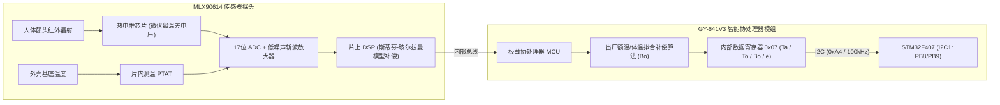

# GY-641V3 / MLX90614 红外体温传感器通信协议与驱动技术手册

**文件编号：MMP-HW-004　｜　版本：v1.0（基线冻结版）　｜　编制日期：2026-09-18**  
**对应模块：非接触式红外体温监测（TEMP: 额温 / 环境温 / 物体辐射温）**  
**核心器件：迈来芯 (Melexis) MLX90614ESF-DCC / GY-641V3 智能协处理模组**  
**原始依据：`GY614615V3协议说明.doc`、`STM32_IIC/user/main.c`、Melexis 官方手册**

---

## 1. 方案背景与合同阻塞项 E03 澄清

总合同第 1.2 节指出：仓库资料对温度模组存在“GY-641V3、MLX90614、I2C 从机地址 0xA4 与串口模式”混淆。经对驱动工程与协议说明文档的逐行反编译核验，给出如下明确技术裁定：

1. **实物属性确认**：**GY-641V3（或 GY-614/615 系列）不是裸 MLX90614 探头，而是带有板载微控制器（MCU 协处理器）的智能测温模组**。
2. **I2C 从机地址彻底澄清**：
   * 模块支持标准 I2C 接口；
   * 板载 MCU 固件设定的 **8 位写设备地址为 `0xA4`**，**8 位读设备地址为 `0xA5`**；
   * 其对应到标准 I2C 体系的 **7 位物理地址为 `0x52`**（`0xA4 >> 1 = 0x52`）；
   * **禁止与裸芯片原生 MLX90614 的 7 位地址（`0x5A`）混淆**。
3. **温度计算公式彻底澄清**：
   * 原生 MLX90614 的 SMBus 寄存器输出的是绝对开尔文温度（分辨率 0.02 K，公式为 `T = Raw * 0.02 - 273.15`）；
   * 而 **GY-641V3 桥接板内部协处理器已在固件中完成了摄氏度换算与额温补偿算法**，其寄存器直接输出 `摄氏度 × 100` 的整数值，换算公式必须为：
     ```c
     温度 (℃) = (MSB * 256 + LSB) / 100.0
     ```
   * **严禁对 GY-641V3 读出的数值重复套用原生 MLX90614 的开氏度公式**，否则会导致严重数学错误。

---

## 2. 测量物理机理与内部架构

### 2.1 普朗克辐射定律与热电堆感测机理
* 任何高于绝对零度（-273.15 ℃）的物体，均会向外界辐射红外电磁波，其全波长总辐射通量与物体表面热力学绝对温度的四次方成正比（斯蒂芬-玻尔兹曼定律）：
  ```
  E = ε · σ · T^4
  ```
  其中 `ε` 为物体表面发射率（人体皮肤发射率约为 0.98），`σ` 为斯蒂芬-玻尔兹曼常数。
* **探头内部结构**：
  * **热电堆吸收区（Thermopile）**：由数百对微型热电偶串联构成的硅基微机械薄膜，吸收目标红外辐射后产生微伏级温差电动势；
  * **内部环境测温元件（PTAT）**：精密片上硅温度传感器，实时测量传感器金属外壳自身的本体基底温度（`Ta`）；
  * **定制信号处理 ASIC**：集成超低失调低噪声斩波放大器、17 位 Delta-Sigma 高精度 ADC 与片上数字信号处理器（DSP）。



---

## 3. 电气特性与硬件接口接线

### 3.1 模块与 STM32F407 接口连接全表

| 模组引脚标号 | 信号名称 | STM32 硬件引脚 | 复用功能 | 作用说明与连接规范 |
| :---: | :--- | :---: | :--- | :--- |
| **VCC** | +3.3V / +5V | `+3.3V` | 系统电源 | 模块内置 LDO，支持 3.3V 或 5V 宽电压供电，推荐接开发板纯净 3.3V。 |
| **GND** | 电源地 | `GND` | 电源地 | 严格共地。 |
| **SCL** | I2C 时钟 | `PB8` | I2C1_SCL | 挂载于硬件 I2C1，时钟频率设定为 100 kHz（开漏输出，板载 4.7k 上拉）。 |
| **SDA** | I2C 数据 | `PB9` | I2C1_SDA | 挂载于硬件 I2C1，双向数据线（开漏输出，板载 4.7k 上拉）。 |

---

## 4. 模式一：I2C 通信协议规范（首版基准模式）

### 4.1 通信基本参数
* **通信接口**：标准 I2C，传输速率 <= 100 kHz；
* **从机地址**：
  * **写操作地址**：`0xA4`（包含写标志位 0）；
  * **读操作地址**：`0xA5`（包含读标志位 1）；
  * **对应 7 位标准地址**：`0x52`。

### 4.2 寄存器读取流程（读取 0x07 寄存器）
读取目标数据时，主机向模块发送寄存器起始地址 `0x07`，随后连续发起读操作接收 **7 个数据字节**：

```sequenceDiagram
    participant MCU as STM32F407
    participant GY as GY-641V3 测温模组

    MCU->>GY: START + 0xA4 (写从机地址)
    GY-->>MCU: ACK
    MCU->>GY: 0x07 (目标数据寄存器地址)
    GY-->>MCU: ACK
    MCU->>GY: RESTART + 0xA5 (读从机地址)
    GY-->>MCU: ACK
    GY-->>MCU: Byte 0 (发射率 e)
    MCU->>GY: ACK
    GY-->>MCU: Byte 1 (物表温高字节 To_H)
    MCU->>GY: ACK
    GY-->>MCU: Byte 2 (物表温低字节 To_L)
    MCU->>GY: ACK
    GY-->>MCU: Byte 3 (环境温高字节 Ta_H)
    MCU->>GY: ACK
    GY-->>MCU: Byte 4 (环境温低字节 Ta_L)
    MCU->>GY: ACK
    GY-->>MCU: Byte 5 (补偿体温高字节 Bo_H)
    MCU->>GY: ACK
    GY-->>MCU: Byte 6 (补偿体温低字节 Bo_L)
    MCU->>GY: NACK + STOP
```

### 4.3 7 字节数据含义与摄氏度换算公式全表

| 字节序列 | 字段含义 | 数据类型 | 物理换算公式 | 正常生理/工程范围 |
| :---: | :--- | :---: | :--- | :---: |
| **Byte 0** | 发射率 ε | `uint8` | `ε = Byte 0 / 100.0` | 出厂默认 95～98（即 0.95～0.98） |
| **Byte 1 ~ 2** | **物表目标温度 (To)** | `int16_be` | `To (℃) = ((int16_t)(Byte 1 << 8 | Byte 2)) / 100.0` | 额头皮肤表面辐射温度（通常 31.0～34.5 ℃） |
| **Byte 3 ~ 4** | **环境基准温度 (Ta)** | `int16_be` | `Ta (℃) = ((int16_t)(Byte 3 << 8 | Byte 4)) / 100.0` | 室温/芯片本体温度（通常 15.0～35.0 ℃） |
| **Byte 5 ~ 6** | **人体补偿体温 (Bo)** | `int16_be` | `Bo (℃) = ((int16_t)(Byte 5 << 8 | Byte 6)) / 100.0` | **医用额温换算体温**（正常范围 36.0～37.3 ℃） |

> [!IMPORTANT]
> **上位机与大屏显示规范**：
> 界面必须严格区分展示：**“当前体温 (Bo)”** 与 **“环境温 (Ta)”**。在人体尚未对准探头时，物表温度 To 接近环境温 Ta，此时补偿体温 Bo 无效，系统应在体温看板显示 `--` 并提示“请对准额头”，不得将室温当作发热或低体温报告。

---

## 5. 模式二：UART 串口通信协议规范（备用模式）

若系统将引脚配置为串口通信，模块自动按 9600 bps 波特率主动循环广播数据：

* **串口规范**：9600 bps，8 位数据位，1 位停止位，无校验；
* **数据帧结构（共 12 字节）**：
  `0xA4 0x03 0x07 0x06 [e] [To_H] [To_L] [Ta_H] [Ta_L] [Bo_H] [Bo_L] [CKSUM]`
  * `0xA4`：帧头；
  * `0x03`：读命令响应；
  * `0x07`：寄存器起始；
  * `0x06`：数据长度（6 字节）；
  * `CKSUM`：低字节校验累加和 `(0xA4 + 0x03 + ... + Bo_L) & 0xFF`。

---

## 6. 临床工程操作与测量规范

1. **测温距离与视场角控制**：
   * MLX90614ESF-DCC 探头具有约 35° 的测量视场角（FOV）；
   * **推荐测量距离保持在 1 ～ 3 cm**；距离过远（>5cm）会导致环境背景红外辐射计入视场，使测得体温严重偏向环境温度；
2. **人体被测部位规范**：
   * 垂直对准额头中心（眉心上方 1～2 cm）；
   * 额头表面必须干燥无汗水（汗液蒸发吸热会导致测得温度偏低 1～2 ℃），且无刘海发丝遮挡；
3. **环境热平衡热适应**：
   * 监护仪从低温室外移至高温室内（或反之）时，必须静置 15 分钟待传感器外壳与内部基准达到环境热平衡后再开始测量。
