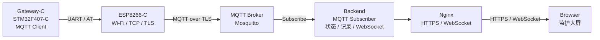
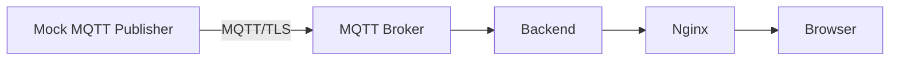

# P 第一阶段执行方案合同：Gateway-C → 云端 → Web（标准协议版）

> **文件编号**：MPM-P-SOW-001  
> **版本**：v0.2（替代 v0.1）  
> **日期**：2026-09-20  
> **负责人**：P  
> **对应总合同**：《多参数监护仪_总开发合同与系统方案_v0.7》  
> **仓库**：`Serendipity-min/medical-multi-parameter-monitor`（Private）  
> **资料基线**：仓库 Commit `533eeb2be4b7a59fed69f898cbc149bf2bd98a20` 中的硬件/云端归档资料 + 最终总合同 v0.7  
> **阶段范围**：先完成 P 负责的 **Gateway-C 网络出口骨架、MQTT/TLS 云端接入、MQTT Broker、Backend、Nginx、Web 大屏与模拟数据联调**；A/B 传感器及真实 CANopen 数据未完成时，使用 Mock MQTT Publisher 代替。  
> **说明**：本合同自签发后替代此前 `P_第一阶段_云端先行执行方案合同_v0.1`。旧版以“Gateway WSS → Nginx → Backend”为设备入口，不再作为最终执行架构。

---

# 0. 本次合同修订依据

## 0.1 最终协议基线

按照总合同 v0.7，P 负责链路统一为：

```text
Node-A / Node-B
        ↓
CANopen CC / CiA 301
        ↓
Gateway-C / STM32F407-C
        ↓
MQTT 3.1.1 Client
        ↓
ESP8266-C（Wi-Fi / TCP / TLS）
        ↓
MQTT over TLS
        ↓
腾讯云 MQTT Broker
        ↓
Backend
        ↓
Nginx
        ↓
HTTPS / WebSocket
        ↓
Browser
```

本阶段不再开发：

- MMP-BUS/1；
- MMP/2；
- MVIEW/1；
- Gateway 直接 WSS 上传接口；
- Backend 的 MMP 二进制解析器。

## 0.2 对 Commit `533eeb2` 现有云端资料的处理

Commit `533eeb2` 已经形成了腾讯云、域名、SSL、Nginx、FastAPI/WebSocket、Web 大屏等基础资料。本合同不推翻这些工作，而是按 v0.7 做协议层迁移。

### 继续复用

- 腾讯云服务器与域名部署思路；
- HTTPS / TLS 安全基线；
- Nginx 作为 Web 统一入口；
- Backend 仅在服务器内部监听；
- FastAPI 作为后端候选；
- 浏览器 WebSocket 实时推送；
- Canvas 2D / WebGL 高频波形绘制思路；
- Docker / Compose 可复现部署思路；
- 日志、备份、回滚、24h 稳定性验证原则。

### 需要替换

```text
旧：
Gateway / Mock Gateway
    ↓ WSS
Nginx
    ↓
Backend MMP Parser

新：
Gateway / Mock MQTT Publisher
    ↓ MQTT over TLS
MQTT Broker
    ↓ Subscribe
Backend
```

因此，旧文档中设备侧 `/device/v1/ingest` WSS、`MMP/1` / `MMP/2` 解析和对应 Token 入口，不再作为最终设备上云方案。

---

# 1. 第一阶段目标

本阶段的核心目标是：

> **在 A/B 传感器尚未完成的情况下，P 先把“云端半边系统”和 Gateway-C 的公网出口骨架做通，使后续真实 CANopen 数据到位后只需要替换数据源，不重新开发云端。**

第一阶段完成后形成两个闭环。

## 1.1 云端模拟闭环

```text
Mock MQTT Publisher
        ↓
MQTT/TLS
        ↓
Mosquitto / MQTT Broker
        ↓
Backend Subscriber
        ↓
WebSocket
        ↓
Nginx
        ↓
Browser Web 大屏
```

## 1.2 Gateway-C 网络闭环

在不等待 Node-A / Node-B 的情况下，由 Gateway-C 自己生成测试数据：

```text
Gateway-C / STM32F407-C
        ↓
MQTT Client
        ↓ UART / AT
ESP8266-C
        ↓ TLS
MQTT Broker
        ↓
Backend
        ↓
Web
```

第一阶段 **不要求 CANopen 输入真实生理数据**。CANopen 接收端只预留接口，等 A/B 节点完成后进入下一阶段联调。

---

# 2. P 第一阶段责任边界

## 2.1 本合同 P 必须完成

1. Git 独立开发分支；
2. 腾讯云现有环境审查与配置备份；
3. MQTT Broker 部署；
4. MQTT/TLS 与身份认证；
5. MQTT Topic ACL；
6. Mock MQTT Publisher；
7. Backend MQTT Subscriber；
8. Gateway / Node / Stream 内部数据模型；
9. Backend → Browser WebSocket；
10. Nginx HTTPS / WebSocket 反向代理；
11. Web 监护大屏 MVP；
12. Gateway-C → ESP8266-C → MQTT Broker 测试链路；
13. 网络断线 / 重连基础验证；
14. 部署、回滚、测试文档。

## 2.2 本合同暂不要求完成

- Node-A / Node-B CANopen 真机接入；
- 最终 CANopen Object Dictionary；
- 最终 PDO 映射；
- AFE4490 / NIBP / TEMP / ADS1292R 真数据；
- RR 算法正式版本；
- Gateway-C Flash 离线缓存正式版；
- A/B ESP8266 冷备用；
- 最终数据库；
- 最终医疗报警规则；
- 最终 UI 美化；
- 最终样机。

P 的 RR 算法仍属于总合同职责，但不作为本“Gateway-C → 云端 → Web”第一阶段的主线交付；云端只预留 `RR` 数据对象并使用模拟值进行联调。

---

# 3. 第一阶段技术架构

## 3.1 最终方向



## 3.2 开发阶段模拟入口



Mock Publisher 与真实 Gateway-C 必须遵循同一份 Topic 和内部数据语义。这样后续替换数据源时，Backend 与 Web 不需要重新设计。

---

# 4. Git 与开发分支合同

## 4.1 分支原则

P 第一阶段不直接在 `main` 开发。

建议分支：

```text
dev/p-gateway-cloud-v07
```

执行前先确认最终总合同 v0.7 已经进入当前 `main`。若仓库当前 `main` 尚未包含 v0.7，应先完成总合同归档，再从最新 `main` 建分支。

建议流程：

```bash
git switch main
git pull
git switch -c dev/p-gateway-cloud-v07
```

阶段完成：

```text
dev/p-gateway-cloud-v07
        ↓ PR
integration/v0.7（如项目采用集成分支）
        ↓ 系统联调稳定
main
```

## 4.2 不允许提交的内容

禁止提交：

- MQTT Broker 私钥；
- MQTT 设备密码；
- TLS 私钥；
- 腾讯云 SSH 私钥；
- 正式域名 API Token；
- `.env` 真实密钥文件。

仓库仅保留：

```text
.env.example
*.example.conf
README
部署模板
```

---

# 5. 云端部署方案

## 5.1 服务角色

腾讯云一期部署：

```text
MQTT Broker
    +
Backend
    +
Nginx
    +
Web Frontend
```

建议第一阶段保持简单：

| 服务 | 一期建议 |
|---|---|
| MQTT Broker | Eclipse Mosquitto |
| Backend | FastAPI / Python |
| Web | Vite + TypeScript |
| 波形绘制 | Canvas 2D |
| Web 入口 | 现有 Nginx |
| 部署 | Docker Compose 或现有容器体系 |
| 数据库 | 第一阶段可先使用轻量存储，最终选型后置 |

## 5.2 公网端口

一期建议：

```text
22    SSH，仅管理员受控来源
80    HTTP → HTTPS / ACME
443   HTTPS / WebSocket
8883  MQTT over TLS
```

禁止直接公网暴露：

```text
Backend 内部端口
数据库端口
Redis
裸 TCP 调试端口
CAN 调试服务
Mosquitto 非 TLS 1883
```

> MQTT 设备入口与 Web 入口分离：MQTT/TLS 直接进入 Broker；Nginx 继续负责 Web HTTPS 与浏览器 WebSocket。第一阶段不强行让 Nginx 代理 MQTT。

---

# 6. MQTT/TLS 合同

## 6.1 协议

冻结：

> **MQTT 3.1.1 over TLS**

MQTT Broker 优先采用标准 Mosquitto。

## 6.2 身份与权限

第一阶段至少满足：

- `allow_anonymous false`；
- Gateway 独立 Client ID；
- 独立用户名/凭据；
- Topic ACL；
- TLS 服务器证书验证；
- 后端使用独立只读订阅身份。

正式凭据不提交 Git。

## 6.3 Gateway 在线状态

使用 MQTT Last Will 表达 Gateway 异常离线。

原则：

```text
正常连接：
Gateway 发布 ONLINE

非正常断开：
Broker 发布 LWT = OFFLINE
```

Gateway 当前状态可使用 Retained Message，使新订阅者立即获得最新状态。

## 6.4 QoS 初步规则

当前只冻结原则：

| 数据 | 一期规则 |
|---|---|
| ECG / PPG / RESP 高频实时波形 | 优先 QoS 0，降低实时流堆积 |
| SpO2 / HR / RR / TEMP 等关键标量 | QoS 1 |
| NIBP 测量结果 | QoS 1 |
| Gateway / Node 状态 | QoS 1 |
| Fault / Event | QoS 1 |
| 历史补传 | QoS 1 |

若后续实测表明高频波形也必须可靠留存，则依靠 Gateway 离线缓存和 REPLAY 机制补偿，而不是简单将全部实时波形升级到 QoS 1。

---

# 7. 第一阶段 Topic 与数据语义

总合同 v0.7 不提前冻结最终完整 Topic。本合同为了云端开发，冻结一套 **P1 开发基线**，后续允许通过兼容版本升级调整。

## 7.1 Topic 基线

```text
mpm/v1/{gateway_id}/status

mpm/v1/{gateway_id}/{node_id}/status

mpm/v1/{gateway_id}/{node_id}/telemetry/{stream}

mpm/v1/{gateway_id}/{node_id}/replay/{stream}

mpm/v1/{gateway_id}/{node_id}/event
```

示例：

```text
mpm/v1/gw01/node-a/telemetry/spo2
mpm/v1/gw01/node-b/telemetry/ecg
mpm/v1/gw01/node-b/telemetry/rr
mpm/v1/gw01/node-a/telemetry/nibp
```

## 7.2 内部统一数据模型

所有数据进入 Backend 后至少保留：

```text
gateway_id
node_id
stream
timestamp
seq
validity
source
value / samples
unit
```

其中：

```text
source = LIVE | REPLAY | MOCK
validity = VALID | INVALID | STALE | OFFLINE
```

主要 Stream：

```text
ECG
HR
RESP
RR
PPG
SPO2
PR
NIBP
TEMP
NODE_STATUS
GATEWAY_STATUS
FAULT
```

这份内部数据模型同时作为未来 CANopen Object Dictionary → MQTT 的桥接语义基础。

## 7.3 Payload

第一阶段 Mock Publisher 与低频标量采用 JSON，便于联调。

示例：

```json
{
  "timestamp": 1789760000000,
  "seq": 1024,
  "validity": "VALID",
  "source": "MOCK",
  "value": 98,
  "unit": "%"
}
```

高频波形第一阶段可先使用 JSON 数组验证链路；真实 Gateway-C 性能联调时，再决定是否切换为紧凑二进制 Payload。

因此本阶段 **不提前冻结最终 ECG/PPG/RESP 二进制结构**。

---

# 8. Backend 合同

## 8.1 Backend 输入

Backend 不接受自定义 MMP 网络协议。

其设备侧输入为：

```text
MQTT Broker Subscription
```

Backend 订阅：

```text
mpm/v1/+/+/telemetry/+
mpm/v1/+/+/status
mpm/v1/+/status
mpm/v1/+/+/event
mpm/v1/+/+/replay/+
```

实际 ACL 和订阅范围在部署时按安全原则收紧。

## 8.2 Backend 内部模块

第一阶段至少分为：

```text
MQTT Adapter
    ↓
Canonical Data Model
    ↓
State Store
    ↓
WebSocket Hub
    ↓
Web
```

可附加：

```text
Recording / History
```

但不得让 Web 前端直接订阅 MQTT Broker。

## 8.3 Backend 状态管理

至少管理：

- Gateway Online / Offline；
- Node-A Online / Stale / Offline；
- Node-B Online / Stale / Offline；
- 各 Stream 最后更新时间；
- `VALID / INVALID / STALE`；
- `LIVE / REPLAY / MOCK`。

---

# 9. Nginx 与 Web 合同

## 9.1 Nginx

沿用 Commit `533eeb2` 已有的 Nginx 思路，职责调整为：

```text
Nginx :443
├── /
│   └── Web Frontend
├── /api/
│   └── Backend REST
└── /ws/
    └── Browser WebSocket
```

Nginx 不再负责设备 Gateway 的 WSS ingest。

配置修改要求：

1. 先备份现有配置；
2. `nginx -t` 通过；
3. 再 reload；
4. 不破坏服务器现有站点。

## 9.2 Web 大屏 MVP

第一阶段至少显示：

- Gateway 状态；
- Node-A 状态；
- Node-B 状态；
- ECG 模拟/真实测试波形；
- PPG 模拟/真实测试波形；
- RESP 模拟/真实测试波形；
- SpO2；
- PR；
- NIBP；
- TEMP；
- HR；
- RR；
- 数据最后更新时间；
- `MOCK / LIVE / REPLAY` 标签。

第一阶段不要求最终视觉美化，先保证结构和数据流正确。

---

# 10. Mock MQTT Publisher 合同

## 10.1 作用

Mock Publisher 用于在 A/B 和 Gateway-C 尚未全部完成时模拟系统。

模拟结构：

```text
GW-DEV-001
├── NODE-A
│   ├── PPG
│   ├── SPO2
│   ├── PR
│   └── NIBP
│
└── NODE-B
    ├── TEMP
    ├── ECG
    ├── HR
    ├── RESP
    └── RR
```

## 10.2 必须支持

- Online / Offline；
- 正常值 / Invalid；
- LIVE；
- REPLAY；
- MOCK；
- 网络断开 / 重连；
- 高频波形持续发布；
- 标量周期发布；
- Fault/Event 模拟。

Mock 数据必须明确标记 `MOCK`，不能与真实生理数据混淆。

---

# 11. Gateway-C 网络出口合同

## 11.1 第一阶段 Gateway-C 输入

A/B 未完成时：

```text
Synthetic Telemetry Generator
        ↓
Gateway 内部数据模型
        ↓
MQTT Client
```

后续：

```text
CANopen PDO / Object Dictionary
        ↓
Gateway 内部数据模型
        ↓
MQTT Client
```

这样 CANopen 接入不会改变 MQTT 和云端业务层。

## 11.2 ESP8266-C 职责

ESP8266-C 负责：

- Wi-Fi STA；
- DNS；
- TCP；
- TLS / SSL Socket；
- 连接状态上报。

不要求使用 ESP8266 的 MQTT AT 命令。

## 11.3 STM32F407-C MQTT Client

MQTT 协议逻辑运行在 Gateway-C 主控。

优先评估成熟嵌入式 MQTT 库，例如：

```text
Eclipse Paho Embedded C
```

实现时提供 Network Adapter：

```text
mqtt_read()
mqtt_write()
```

底层映射到 ESP8266-C SSL Socket 的 AT 收发。

候选库只作为实施建议；最终使用版本需完成许可证与资源占用核验后冻结。

## 11.4 第一阶段 Gateway-C 准出

至少打通：

```text
STM32F407-C synthetic data
        ↓
MQTT 3.1.1 Client
        ↓
ESP8266-C SSL Socket
        ↓
Mosquitto :8883
        ↓
Backend
        ↓
Web
```

这一步成功后，后续 A/B 的 CANopen 数据只需接入 Gateway 内部数据模型。

---

# 12. CANopen 接口预留

第一阶段不等待 Node-A/B，但 Gateway-C 软件要预留 CANopen Adapter。

后续数据路径：

```text
CANopenNode / CANopen Stack
        ↓
PDO / SDO / Heartbeat / EMCY
        ↓
Gateway Canonical Data Model
        ↓
MQTT Publisher
```

Gateway-C 后续作为：

- NMT 管理/汇聚节点；
- PDO Consumer；
- SDO Client（必要时）；
- Heartbeat Consumer；
- EMCY Consumer。

Object Dictionary 和 PDO 映射另由《CANopen 对象字典与 PDO 映射设计》冻结，不在本合同提前定义。

---

# 13. 第一阶段执行步骤

## P1-01：仓库与基线整理

完成：

- 确认总合同 v0.7；
- 创建 `dev/p-gateway-cloud-v07`；
- 保留旧 v0.1 作为历史归档；
- 新建 P 第一阶段 v0.2 合同；
- 建立 cloud/gateway 目录边界。

建议：

```text
gateway/
cloud/
├── broker/
├── backend/
├── web/
├── deploy/
└── tools/
    └── mock_mqtt/
```

## P1-02：腾讯云现状审计

只读检查：

- 操作系统；
- Docker；
- Nginx；
- 现有站点；
- 80/443；
- SSL 证书；
- 域名；
- 防火墙 / 安全组；
- 备份路径。

任何改动前必须形成配置备份。

## P1-03：MQTT Broker

完成：

- Mosquitto 部署；
- TLS；
- 8883；
- 匿名访问关闭；
- Gateway 开发账号；
- Backend 订阅账号；
- ACL；
- Broker 日志；
- LWT 测试。

## P1-04：Mock MQTT Publisher

完成多参数模拟和网络故障模拟。

准出：

```text
mosquitto_sub / Backend
可以稳定收到模拟数据
```

## P1-05：Backend MQTT Adapter

完成：

```text
MQTT Subscriber
→ Canonical Data Model
→ State Store
→ WebSocket Hub
```

并完成 `/health`。

## P1-06：Web MVP

完成实时状态和模拟波形展示。

## P1-07：Nginx 接入

完成：

- HTTPS；
- `/api/`；
- `/ws/`；
- Web 静态页面；
- 配置备份；
- `nginx -t`；
- reload。

## P1-08：Gateway-C 网络出口

使用 STM32F407-C + ESP8266-C：

1. Wi-Fi 接入；
2. DNS；
3. SSL Socket；
4. MQTT CONNECT；
5. PUBLISH；
6. Keep Alive；
7. 断线检测；
8. 重连；
9. Synthetic Data → Broker；
10. 云端页面显示。

## P1-09：阶段测试与归档

完成：

- MQTT 断线；
- ESP8266 断线；
- Broker 重启；
- Backend 重启；
- Nginx reload；
- Browser 刷新/重连；
- Gateway 重连；
- LWT；
- QoS 1；
- MOCK / LIVE / REPLAY 区分。

---

# 14. 时间安排

第一阶段建议 **8～10 个工作日**。

| 时间 | P 主要工作 | 阶段结果 |
|---|---|---|
| Day 1 | 分支、基线、腾讯云只读审计、配置备份 | 环境基线 |
| Day 2 | Mosquitto + TLS + 用户/ACL | MQTT Broker |
| Day 3 | Mock MQTT Publisher | 模拟数据入口 |
| Day 4 | Backend MQTT Adapter + 状态模型 | 后端通路 |
| Day 5 | WebSocket + Web MVP | 浏览器实时展示 |
| Day 6 | Nginx HTTPS / WebSocket | 公网 Web |
| Day 7-8 | STM32F407-C + ESP8266-C MQTT/TLS | Gateway 真机上云 |
| Day 9 | 断线/重连/LWT/QoS/故障测试 | 可靠性结果 |
| Day 10 | 文档、问题整改、阶段验收 | P1 结项 |

A/B 传感器开发可与本计划完全并行。

---

# 15. 第一阶段测试矩阵

| 测试 | 期望 |
|---|---|
| Mock → Broker | 数据连续到达 |
| Broker TLS | 非 TLS 设备不得进入正式 listener |
| 错误密码 | 拒绝连接 |
| Topic 越权 | ACL 拒绝 |
| LWT | 非正常断线后状态变 Offline |
| QoS 1 | 关键标量收到 PUBACK |
| Backend 重启 | 恢复订阅和状态 |
| Broker 重启 | Gateway / Mock 可重连 |
| ESP Wi-Fi 断开 | Gateway 检测并重连 |
| Nginx reload | Web 入口恢复且不破坏其他站点 |
| Browser 刷新 | 自动重新建立 WebSocket |
| MOCK 标签 | 模拟数据明确标记 |
| LIVE / REPLAY | 前端不混淆 |
| Gateway Synthetic Data | F407-C → ESP8266-C → Broker → Web 闭环成功 |

---

# 16. 交付物

建议仓库输出：

```text
doc/P/
├── P_第一阶段_GatewayC云端Web执行方案合同_v0.2.md
├── P_第一阶段执行报告.md
├── MQTT_Topic与数据语义_v0.1.md
├── 腾讯云部署与回滚说明.md
└── P1_测试报告.md

gateway/
├── mqtt/
├── esp_at/
└── mock_source/

cloud/
├── broker/
├── backend/
├── web/
├── deploy/
└── tools/
    └── mock_mqtt/
```

其中：

- 真正密钥不进入仓库；
- `.env.example` 只提供字段模板；
- 部署脚本必须具备第二人复现条件。

---

# 17. 第一阶段准出条件

满足以下条件，P 第一阶段判定完成：

```text
[ ] 总合同 v0.7 已作为执行基线
[ ] 开发位于独立分支
[ ] 腾讯云原有配置已备份
[ ] MQTT Broker 正常运行
[ ] MQTT/TLS 正常
[ ] 匿名连接关闭
[ ] Gateway / Backend ACL 生效
[ ] Mock MQTT Publisher 可持续发布
[ ] Backend 可订阅并转换统一数据模型
[ ] Gateway / Node 状态可展示
[ ] Web 能显示 ECG / PPG / RESP 模拟波形
[ ] Web 能显示 SpO2 / PR / NIBP / TEMP / HR / RR
[ ] MOCK / LIVE / REPLAY 可区分
[ ] Nginx HTTPS / WebSocket 正常
[ ] Backend 内部端口未直接暴露公网
[ ] STM32F407-C + ESP8266-C 可通过 MQTT/TLS 发布测试数据
[ ] Gateway 断线后可自动恢复
[ ] LWT 能反映 Gateway 异常离线
[ ] 第二人可按 README 启动云端开发环境
[ ] 第一阶段测试报告完成
```

---

# 18. 与下一阶段交接

P1 完成后，不需要重构云端。

后续数据源替换：

```text
当前：
Synthetic / Mock Data
        ↓
Gateway Canonical Data Model
        ↓
MQTT
        ↓
Cloud

后续：
Node-A / Node-B
        ↓
CANopen
        ↓
Gateway Canonical Data Model
        ↓
同一 MQTT
        ↓
同一 Cloud
```

下一阶段主要新增：

1. CANopenNode / CANopen 栈；
2. CANopen Object Dictionary；
3. PDO 映射；
4. Node-A / Node-B Heartbeat；
5. Gateway 对 CANopen 数据的读取；
6. 真实传感器数据替换 Synthetic Data；
7. Gateway 离线 Flash 缓存；
8. 根据真实数据完善 Web 和记录策略。

---

# 19. v0.1 → v0.2 迁移表

| v0.1 | v0.2 |
|---|---|
| Gateway WSS 直接上传 | Gateway MQTT 3.1.1 over TLS |
| Nginx 接收设备 WSS | Mosquitto 接收 MQTT；Nginx 只负责 Web |
| `/device/v1/ingest` | MQTT Broker :8883 |
| MMP/2 Adapter | MQTT Adapter |
| Mock Gateway WSS | Mock MQTT Publisher |
| Gateway Token Query/自定义入口 | MQTT Client ID + TLS + Broker Auth + ACL |
| WSS Device Heartbeat | MQTT Keep Alive + Last Will |
| 自定义设备消息可靠性 | MQTT QoS |
| 自定义最新状态处理 | MQTT Retain |
| MMP/2 LIVE/REPLAY | MQTT Topic/Payload 中的 LIVE/REPLAY |
| 后续替换 WSS 数据源 | 后续 CANopen → Gateway Data Model → MQTT |

---

# 20. 合同签署

本合同作为 P 第一阶段正式执行基线，自 v0.2 起替代 v0.1。

| 角色 | 责任 | 确认 | 日期 |
|---|---|---|---|
| P | Gateway-C / MQTT / 云端 / Nginx / Backend / Web | ______ | ______ |
| 项目成员 A | 后续 Node-A CANopen 对接 | ______ | ______ |
| 项目成员 B | 后续 Node-B CANopen 对接 | ______ | ______ |

---

# 附录 A：第一阶段最终链路

```text
A/B 尚未完成期间：

Mock MQTT Publisher
        ↓
MQTT/TLS
        ↓
Tencent Cloud Mosquitto
        ↓
Backend
        ↓
Nginx / WebSocket
        ↓
Browser


同时 P 开发：

STM32F407-C
        ↓
MQTT Client
        ↓ UART / AT
ESP8266-C
        ↓ TLS
Tencent Cloud Mosquitto
        ↓
Backend
        ↓
Web


A/B 完成后：

Node-A ─┐
        ├── CANopen → Gateway-C → MQTT/TLS → Broker → Backend → Web
Node-B ─┘
```

---

# 附录 B：技术选型参考

本阶段优先评估成熟开源生态：

- CANopen：CANopenNode / CanOpenSTM32；
- MQTT Embedded Client：Eclipse Paho Embedded C；
- MQTT Broker：Eclipse Mosquitto；
- Backend：FastAPI；
- Web：Vite + TypeScript + Canvas；
- Reverse Proxy：Nginx。

具体版本和许可证在实际引入代码时核验并记录，不在本合同提前锁定。
