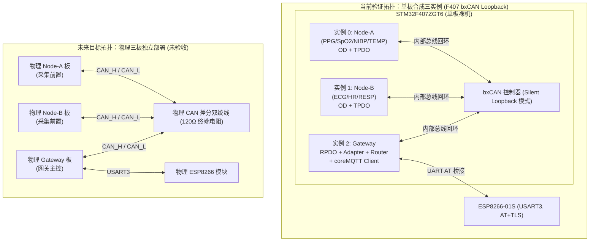
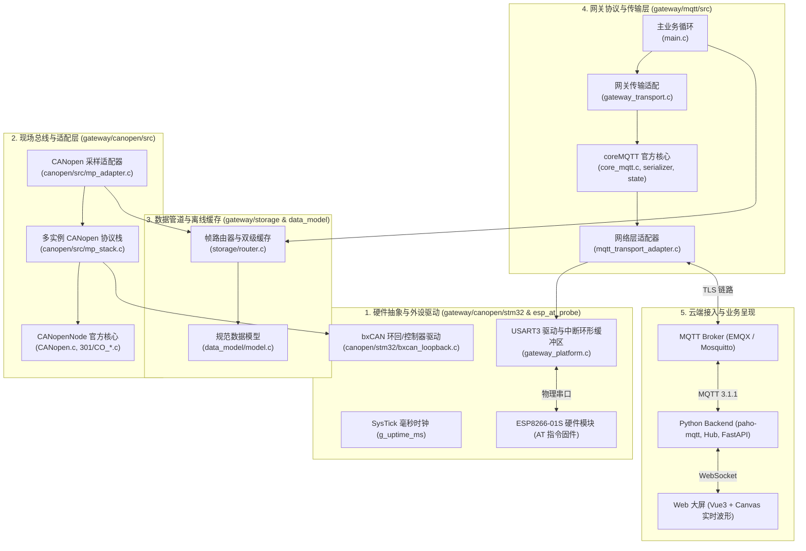
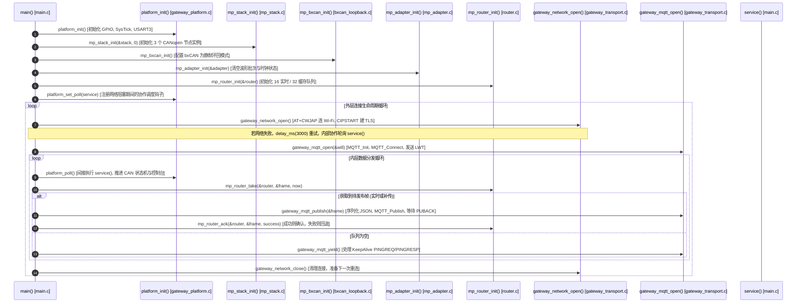
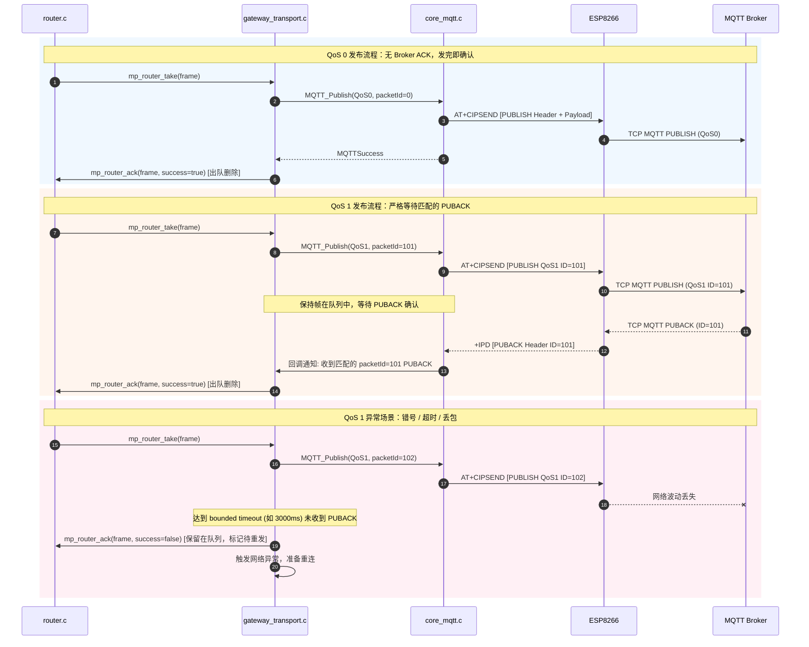
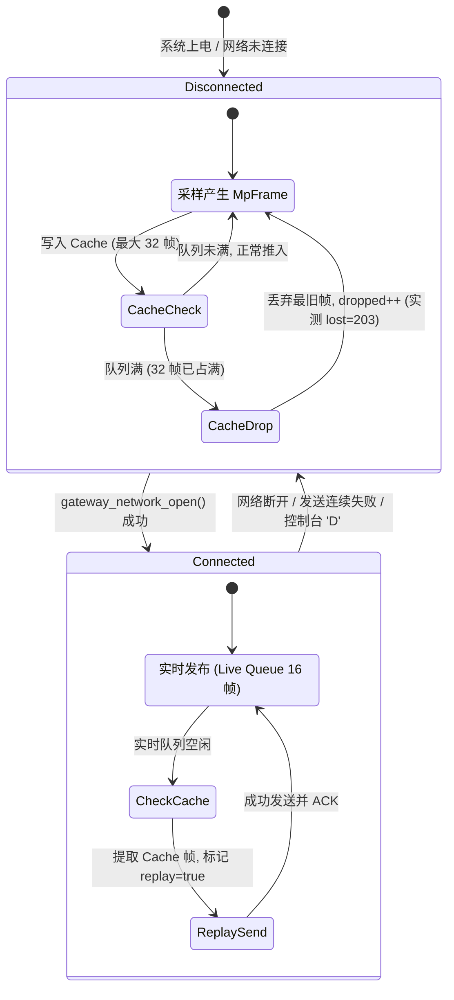
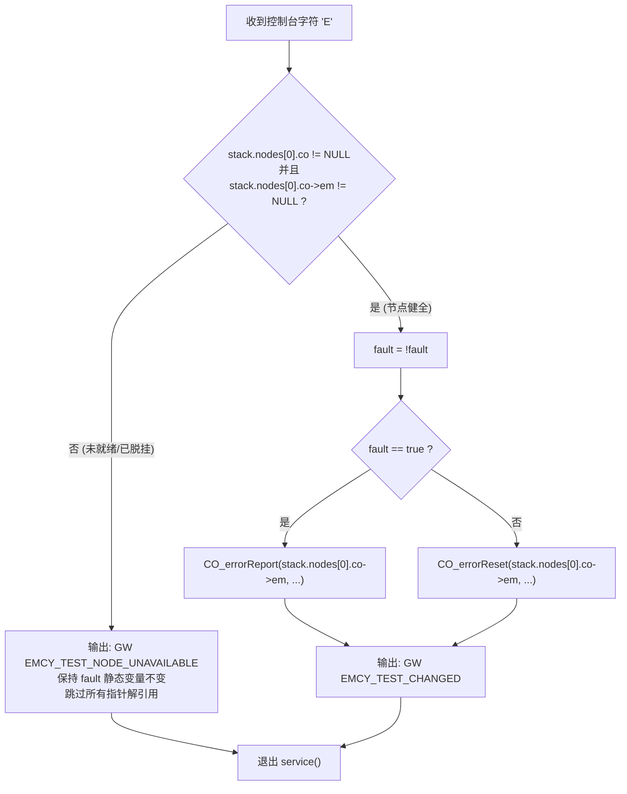

# P5 coreMQTT 网关运行机制与源码调用链 v2.0

> **版本标识与代码基线**
> - **文档版本**：v2.0
> - **当前代码修复提交 (CODE_FIX_COMMIT)**：`2e13ff3be398ae33ab4d4ab8a9ba0fec3c5d6855`
> - **前序审计固定起点 (START_HEAD)**：`cc2c3a9fa135958aa26613821f11f411f54f62ae`
> - **第四阶段基线提交 (P4_BASE)**：`8dee339491cfd4edc468bb9451511d421f26db5e`
> - **历史 Security Gate 独立复跑 SHA**：`d1e7388a91149a7c66e6cf1a5df7321bbb8eab12` (CONDITIONAL_PASS / EXIT_2)
> - **历史短 Smoke 固件 BIN SHA-256**：`7694dc192fa26e2e5050f24eeae78328b9ecf80164cb6ff84cb139931b26938a` (43.812s / 25帧上报)
> - **当前物理开发板回读全片 Flash SHA-256**：`15102707252277d32db8df1f88764b85cefb2b3117462fa03328e75294a50d2f` (1MiB 双读一致，板载无 P5 固件)
> - **文档正式提交 (DOCS_COMMIT)**：将在本文档纳入 Git 提交后记录于外部交接回执中，正文不自引用。

---

## 1. 系统背景、迁移动机与架构拓扑

### 1.1 从 P4 Paho 到 P5 coreMQTT 的迁移动机与工程边界

在多参数心电监护仪系统（Multi-Parameter Monitor, MPM）开发过程中，网关模块承担着汇聚现场多节点生理波形与体征数据、并在恶劣或断网环境下可靠上云的核心职责。

- **P4 阶段选型与痛点**：
  P4 阶段网关固件采用经过加固的 Eclipse Paho Embedded C 库。虽然完成了基本发布链路，但 Paho Embedded C 在裸机长周期运行中暴露了内存边界难以精确控制、网络断开后内部状态机清理逻辑不透明、以及跨包分片等待与单片机看门狗/协作调度耦合过紧的问题。
- **P5 阶段引入 FreeRTOS/coreMQTT v2.3.1 的动机**：
  coreMQTT 是 AWS / FreeRTOS 专门面向受限嵌入式环境设计的 MQTT 3.1.1 客户端。其核心优势在于：
  1. **零动态内存分配 (Zero Dynamic Allocation)**：所有上下文与序列化缓冲区由调用方静态提供，消除堆碎片与内存泄漏隐患；
  2. **完全解耦的 I/O 契约**：通过 `TransportInterface_t`（包含 `send`、`recv`、`writev`）将协议解析与底层传输（ESP8266 AT 驱动）彻底分离；
  3. **严格的状态机与有界解析**：对 MQTT 报文头、长度字段、PUBACK 校验提供确定性防御。
- **必须澄清的工程事实与边界**：
  - **并非“全系统废弃 Paho”**：后端 Python 数据服务（`cloud/backend`）依然使用标准 `paho-mqtt` 客户端订阅 Broker，架构上是 C 网关（coreMQTT）与 Python 后端（paho-mqtt）共存；
  - **协议版本仍为 MQTT 3.1.1**：未引入 MQTT 5.0 特性；
  - **当前运行环境为单片机裸机 (Baremetal)**：无操作系统，无 FreeRTOS 调度器，所有任务依托 SysTick 与主循环协作轮询完成；P6 阶段 FreeRTOS 任务化迁移尚未启动。

---

### 1.2 两种截然不同的系统拓扑对比

面试或架构答辩时，必须严谨区分以下两种拓扑，禁止将单板合成环境混淆为物理多板已验收环境：

| 维度 | 当前开发/验证拓扑（合成单板回环） | 未来目标物理拓扑（三实体板分布式） |
|---|---|---|
| **物理板卡数量** | 1 块 STM32F407ZGT6 核心板 + 1 块 ESP8266 Wi-Fi 模块 | 3 块物理板（Node-A、Node-B、Gateway-C）+ ESP8266 |
| **CAN 总线形态** | 片内 bxCAN Silent Loopback（静默自回环） | 物理 CAN 总线（双绞线、120Ω 终端电阻、收发器） |
| **CANopen 协议实例** | 1 颗 MCU 内运行 3 个独立 `CO_t` 实例（Node-A、Node-B、Gateway） | 每颗 MCU 独立运行 1 个 `CO_t` 实例 |
| **时钟与采样源** | 单一主晶振与 SysTick 驱动所有节点的虚拟滴答 | 各节点独立晶振，存在微小硬件时钟漂移 |
| **验收状态** | **已完成**：Host 单元测试、ARM 离线构建、短 Smoke 预检 | **未验收/未联调**：物理三板联调属于后续阶段规划 |



---

## 2. 软件总体架构与核心调用链

### 2.1 模块分层与代码文件布局

系统从底层硬件抽象到上层云交互，划分为清晰的五层架构：



---

### 2.2 启动与主循环调用时序

系统在单主线程下协作运行。主循环启动、协议初始化、网络建立与持续轮询调用链如下：



---

### 2.3 关键执行机制：中断、协作轮询与单主线程防饥饿

裸机系统没有抢占式多任务内核，如何保证高波特率串口收发与高实时性 CAN 采样不互相卡死？
1. **SysTick 滴答时钟**：`SysTick_Handler` 仅维护全局递增变量 `volatile uint32_t g_uptime_ms`，严禁在中断中执行耗时计算；
2. **UART3 中断与无锁环形缓冲区**：
   ESP8266 发送的数据通过 `USART3_IRQHandler` 接收，中断例程仅将字节压入固定尺寸环形缓冲区 `g_rx_ring`，不解析 AT 行，不触发 MQTT 逻辑；
3. **协作调度钩子 (`platform_set_poll(service)`)**：
   当网络层处于阻塞等待（如 `at_command` 阻塞等待响应、或 `MQTT_ProcessLoop` 等待网络字节）时，内部循环反复调用 `platform_poll()`。`platform_poll()` 触发 `service()` 回调：
   ```c
   /* gateway/mqtt/src/main.c */
   static void service(void)
   {
       mp_bus_poll();
       /* 预算限制：每次调用最多处理 8ms 的时钟追赶，防止网络完全被 CAN 饿死 */
       unsigned budget = 8;
       while (serviced != g_uptime_ms && budget--)
       {
           serviced++;
           mp_stack_tick(&stack);
           mp_adapter_poll(&adapter, &stack, &router);
       }
       /* 本地调试字符输入处理 */
       ...
   }
   ```
4. **单主线程保证数据一致性**：
   `mp_stack_tick`、`mp_adapter_poll`、`mp_router_take`、`gateway_mqtt_publish` 全部在主线程上下文中串行推进，彻底消除了多线程环境下的临界区锁开销与死锁风险。

---

## 3. CANopen 现场总线与数据适配层

### 3.1 CAN 基础 vs CANopen 协议的区别

- **原生 CAN (Layer 2 - 数据链路层)**：只提供 11 位/29 位 ID、0–8 字节载荷、CRC 校验与仲裁机制，没有任何关于“这是心率还是血压”、“数据该如何解析”、“节点是否掉线”的高层语义；
- **CANopen (Layer 7 - 应用层规范 CiA 301)**：
  1. **对象字典 (Object Dictionary, OD)**：为设备所有参数定义规范化的 16 位索引与 8 位子索引；
  2. **过程数据对象 (PDO)**：无应答高实时数据传输（TPDO 发送，RPDO 接收），通过 OD 映射关系预先绑定；
  3. **服务数据对象 (SDO)**：点对点可靠参数读写；
  4. **网络管理与心跳 (NMT & Heartbeat)**：周期性广播节点生命周期状态（Boot-up、Pre-operational、Operational、Stopped）。

---

### 3.2 节点划分、生理参数映射与异常定义

在当前合成系统中，三实例划分与参数映射定义于 `gateway/canopen/src/mp_od.c` 与 `mp_adapter.c`：

| 节点 | 节点 ID | 映射参数 | 采样频率 | OD 索引与格式 | 异常标志位 / 质量位 |
|---|---|---|---|---|---|
| **Node-A** (前置 A) | 0x01 | PPG (光电容积脉搏波) | 50 Hz | `0x2001:01` (uint16) | 探头脱落、弱灌注标志 |
| | | SpO2 (血氧饱和度) | 1 Hz | `0x2002:01` (uint8, %) | 范围 0–100% |
| | | PR (脉率) | 1 Hz | `0x2003:01` (uint16, bpm) | 0 表示无效 |
| | | NIBP (无创血压) | 事件触发 | `0x2004:01..03` (收缩/舒张/平均) | 充气错误、测量超限 |
| | | TEMP (体温) | 0.1 Hz | `0x2005:01` (uint16, 0.1℃) | 探头未连接 |
| **Node-B** (前置 B) | 0x02 | ECG (心电图) | 250 Hz | `0x2010:01` (int16, 0.1μV) | 导联脱落 (Lead-off) |
| | | HR (心率) | 1 Hz | `0x2011:01` (uint16, bpm) | 心动过速/过缓 |
| | | RESP (呼吸波) | 50 Hz | `0x2012:01` (int16) | 窒息报警 (Apnea) |
| | | RR (呼吸率) | 1 Hz | `0x2013:01` (uint8, rpm) | `0xFF` (`RR INVALID`) |
| **Gateway** (网关) | 0x03 | 自身状态 / 诊断 | 0.2 Hz (5s) | 内部生成，不占外总线 | WiFi 信号、丢包统计 |

> **关键容错语义：`RR INVALID (0xFF)`**
> 当呼吸阻抗算法因体动伪影或基线漂移无法提取有效呼吸率时，Node-B 上报 `RR = 0xFF`。网关适配器保留此原始标志，并在 JSON 中转译为 `null` 或无效质量位，绝不虚构 0 rpm（0 rpm 代表临床窒息），防止误导医护人员。

---

### 3.3 波形批次汇聚与 `MpFrame` 规范模型

高频波形（ECG 250Hz、PPG 50Hz、RESP 50Hz）如果逐点发送 MQTT，会导致巨大的网络开销与 Broker 崩溃。
网关在 `gateway/canopen/src/mp_adapter.c` 中实施 **1 秒固定批次汇聚**：
- **ECG**：每秒累积 250 个采样点（500 字节点阵）；
- **PPG**：每秒累积 50 个采样点（100 字节点阵）；
- **RESP**：每秒累积 50 个采样点（100 字节点阵）。

汇聚后的规范结构体定义于 `gateway/data_model/model.h`：
```c
typedef struct {
    uint8_t node;           /* 源节点 ID: 1=A, 2=B, 3=Gateway */
    MpStream stream;        /* 流类型: ECG, PPG, RESP, HR, SPO2, STATUS 等 */
    uint64_t timestamp;     /* 采样绝对时间戳 (UTC 毫秒, 由 SNTP epoch + 采样偏移计算) */
    uint32_t seq;           /* 该数据流严格单调递增的序号 */
    uint32_t epoch;         /* 网关启动校时锚点 (UNIX 秒) */
    uint32_t boot;          /* 节点启动轮次计数 (高 16 位 Gateway, 低 16 位 Node) */
    bool synthetic;         /* 是否为测试合成数据 (当前固件固定为 true) */
    bool replay;            /* 是否为断网重连后的历史补传帧 */
    /* 载荷联合体：包含标量数据或波形批次数组 */
    ...
} MpFrame;
```

---

## 4. 传输适配层与 coreMQTT 驱动机制

### 4.1 网络 I/O 分工与 ESP8266 AT 责任划分

本系统采用 **MCU + ESP8266 伴侣芯片** 方案。协议栈的职责划分边界极其严格：


- **ESP8266 负责**：
  1. Wi-Fi 物理连接与重连（`AT+CWJAP`）；
  2. TLS 握手、服务端证书 CA 链校验、SNI 域名上报与对端证书主机名校验（CCN）；
  3. SNTP 绝对时间获取（`AT+CIPSNTPCFG` / `AT+CIPSNTPTIME?`）；
  4. 底层 TCP 流量控制与重传。
- **STM32 coreMQTT 负责**：
  1. MQTT 报文编码（CONNECT, PUBLISH, PINGREQ, DISCONNECT）；
  2. 报文解析与 PUBACK 报文 ID 校验；
  3. KeepAlive 保活时钟维护（15 秒超时主动触发 PINGREQ）；
  4. 业务数据队列与断网有损淘汰策略。

---

### 4.2 `TransportInterface_t` 适配层与 `writev` 零拷贝拼装

coreMQTT 依赖三组 I/O 函数指针。在 `gateway/mqtt/src/mqtt_transport_adapter.c` 中实现：
1. `send`：发送单段连续内存；
2. `recv`：非阻塞或有界阻塞接收；
3. `writev`：**向量化聚合写**（关键优化！）。
   coreMQTT 在发布报文时，报文头（固定报文头 + Topic 字符串 + Packet ID）与载荷（JSON 字符串）通常位于不连续的内存区域。如果分两次调用底层 `send`，将触发两次独立的串口 `AT+CIPSEND` 握手与网络发包，严重降低吞吐率。
   `mqtt_transport_adapter.c` 实现的 `writev` 将多个分片在本地静态发送缓冲区中紧凑拼装，通过单次 `AT+CIPSEND=<len>` 一次性推送到 ESP8266，且发送完毕后立即对敏感缓冲区实施擦除。

---

### 4.3 QoS 0 与 QoS 1 的可靠性机制对比



> **核心认知防坑**：
> 1. **QoS 0 ≠ 失败不感知**：若串口写超时或 ESP 返回 `ERROR`，本地发送立刻返回失败；但若已送达 ESP，Broker 是否收到在协议层完全不可知；
> 2. **QoS 1 匹配性校验**：必须验证 PUBACK 中的 `Packet ID` 与本地发送的 ID 严格一致。迟到的、错号的、或上一会话遗留的 PUBACK 均被判定为非法；
> 3. **QoS 1 ≠ Exactly Once**：QoS 1 保证至少一次送达（At Least Once）。在断网重连重发过程中，Broker 或后端可能收到重复报文，因此下游必须支持去重。

---

## 5. 断网缓存、路由器设计与后端去重闭环

### 5.1 双级有界缓存与丢包淘汰模型 (`router.c`)

嵌入式网关 RAM 极度受限（F407 总 RAM 仅 192KB，留给路由缓存仅数千字节），绝不能使用无界动态链表。
`gateway/storage/router.c` 实现了两级静态环形队列：
1. **实时队列 (Live Queue)**：容量 16 帧，优先处理刚采样的波形与状态；
2. **离线缓存队列 (Cache Queue)**：容量 32 帧，当网络断开时，未确认数据与最新关键数据转移至离线缓存；
3. **严格的有界淘汰 (FIFO Drop)**：
   当两级队列总计 48 帧占满时，若继续产生新帧，系统将执行 **最旧帧淘汰**，并递增计数器 `router.dropped`。
   在实际压力测试与历史验收中，明确记录了 `lost=203`。这以无可辩驳的证据表明：**本系统在长时间断网下是有损缓存设计，不承诺全量无损恢复**！



---

### 5.2 后端 Hub 去重、时间窗口与前端呈现

- **三层架构分工**：
  1. **网关层**：生成携带唯一 `(node, stream, seq, boot, epoch)` 的标准化 JSON；
  2. **Broker 层**：负责报文路由分发；
  3. **后端 Python 服务层 (`cloud/backend`)**：
     内置 `Hub` 模块，根据 `(node, stream)` 维护滑动接收窗口。当网关因 QoS 1 重发或网络恢复重传历史帧时：
     - 若收到的 `seq <= last_seq` 且 `boot` 相同，识别为重复帧，记录审计日志并静默丢弃；
     - 若 `replay == true`，将数据归档入历史时序库，不打乱实时大屏的绘制指针；
  4. **前端大屏 (`cloud/web`)**：通过 WebSocket 与后端连接，首帧必须完成 Token 鉴权，仅接收只读实时流与去重后的波形点阵，实现平滑 Canvas 渲染。

---

## 6. 本地控制台调试与 `GEMINI-P5-001` 修复调用链

### 6.1 本地测试单字符指令集

在 `gateway/mqtt/src/main.c` 的 `service()` 函数中，保留了通过串口交互的本地单字符调试入口：

| 字符 | 功能说明 | 对应内部调用 | 预期控制台回执 |
|---|---|---|---|
| `'D'` | 请求主动断开 Wi-Fi 连接 | `disconnect_requested = 1;` | `GW WIFI_TEST_DISCONNECTED` (30s后恢复) |
| `'A'` | 切换 Node-A 使能状态 | `mp_stack_enable(&stack, 1, !enabled)` | `GW NODE_TEST_ENABLED` / `DISABLED` |
| `'B'` | 切换 Node-B 使能状态 | `mp_stack_enable(&stack, 2, !enabled)` | `GW NODE_TEST_ENABLED` / `DISABLED` |
| `'C'` | 模拟 CAN 总线物理通断 | `mp_bus_set_online(!online)` | `GW CAN_TEST_RECOVERED` / `DISCONNECTED` |
| `'R'` | 重启 Node-B 协议栈实例 | `mp_stack_restart(&stack, 2)` | `GW NODE_TEST_RESTARTED` |
| `'G'` | 重启 Gateway 协议栈实例 | `mp_stack_restart(&stack, 3)` | `GW GATEWAY_TEST_RESTARTED` |
| `'E'` | **触发/复位 Node-A 紧急报文 (EMCY)** | `CO_errorReport` / `CO_errorReset` | `GW EMCY_TEST_CHANGED` 或 `NODE_UNAVAILABLE` |

---

### 6.2 `GEMINI-P5-001` 缺陷根因、危害与修复调用链对比

- **缺陷代码 (修复前)**：
  ```c
  if (c == 'E')
  {
      static bool fault;
      fault = !fault;  /* 致命缺陷 1: 在未校验有效性前直接翻转状态 */
      if (fault)
          CO_errorReport(stack.nodes[0].co->em, CO_EM_GENERIC_ERROR, CO_EMC_GENERIC, 0);
      else
          CO_errorReset(stack.nodes[0].co->em, CO_EM_GENERIC_ERROR, 0);
      /* 致命缺陷 2: 若 stack.nodes[0].co 为 NULL，访问 co->em 导致 NULL 指针解引用 HardFault 崩溃！ */
      console("GW EMCY_TEST_CHANGED\r\n");
  }
  ```
- **危害剖析**：
  当 Node-A 因动态初始化失败（如 `CO_new` 内存不足）或重启脱挂时，`stack.nodes[0].co` 被置空。此时若测试人员在控制台键入 `'E'`，MCU 将立刻触发精确总线错误 (`HardFault`)，导致整机系统死锁下线。同时，即使不解引用，异常状态也会错误翻转 `fault` 静态标志，导致后续恢复时 report 与 reset 语义倒置。
- **修复后代码 (当前提交 `2e13ff3`)**：
  ```c
  if (c == 'E')
  {
      static bool fault;
      /* 严谨守卫：同时校验 co 指针与其内部 em 子模块指针 */
      if (!stack.nodes[0].co || !stack.nodes[0].co->em)
      {
          console("GW EMCY_TEST_NODE_UNAVAILABLE\r\n");
      }
      else
      {
          fault = !fault;
          if (fault)
              CO_errorReport(stack.nodes[0].co->em, CO_EM_GENERIC_ERROR, CO_EMC_GENERIC, 0);
          else
              CO_errorReset(stack.nodes[0].co->em, CO_EM_GENERIC_ERROR, 0);
          console("GW EMCY_TEST_CHANGED\r\n");
      }
  }
  ```



---

## 7. 静态配置与动态内存资源台账

本系统遵循严苛的嵌入式高可靠编码规范，除 CANopen 初始化由专有静态池模拟托管外，核心业务与 MQTT 传输层**完全消除动态堆分配 (`malloc`)**。

| 模块 / 结构体 | 分配位置 | 占用大小 (字节) | 归属源文件 | 生命周期 |
|---|---|---|---|---|
| `MpStack stack` | BSS 静态段 | 约 38,400 | `gateway/mqtt/src/main.c` | 系统全生命周期驻留 |
| `MpAdapter adapter` | BSS 静态段 | 约 3,200 | `gateway/mqtt/src/main.c` | 系统全生命周期驻留 |
| `MpRouter router` | BSS 静态段 | 49,576 | `gateway/mqtt/src/main.c` | 16 live + 32 cache 帧缓冲区 |
| `MQTTContext_t` | BSS 静态段 | 约 256 | `gateway/mqtt/src/gateway_transport.c` | coreMQTT 协议上下文 |
| `NetworkContext_t` | BSS 静态段 | 2,120 | `gateway/mqtt/src/mqtt_transport_adapter.c` | 包含 2048 字节发送拼装缓冲区 |
| `g_rx_ring` | BSS 静态段 | 4,096 | `gateway/mqtt/src/gateway_platform.c` | UART3 接收环形无锁缓冲区 |
| **ARM 固件构建总计** | **Flash: 35,624 B** | **RAM BSS: 120,120 B** | **Data: 88 B** | **RAM 占用率约 62.6% (120KB / 192KB)** |

> **关键提醒**：静态 RAM 虽已被严格控制在 120KB（占 F407 192KB 的 62.6%），但**运行时栈高水位（Stack High-Water Mark）尚未完成真机仪器级打标测量**。主循环中 `MpFrame f`（约 1KB）在栈上复制分配，未来任务化迁移时必须为任务分配至少 4KB 独立栈空间。

---

## 8. 4 分钟面试白板讲解提纲

在面试官要求“简要介绍你的 P5 coreMQTT 裸机网关架构”时，可按以下结构在 4 分钟内流畅书写与阐述：

```text
[0:00 - 0:45] 业务背景与定位
- "我们做的是多参数监护仪网关，将 Node-A（PPG/SpO2/NIBP）与 Node-B（ECG/RESP）的生理数据安全上云。"
- "P5 阶段将原 Paho 迁移为 AWS coreMQTT v2.3.1，核心是零动态内存分配与状态解耦，消除了裸机环境下的内存泄漏风险。"
- "强调：MQTT 3.1.1、纯裸机单主线程、后端 Python 仍用 paho-mqtt 订阅。"

[0:45 - 1:45] 拓扑与调度模型 (画出分层框图)
- "当前验证拓扑是单块 F407 利用 bxCAN 静默环回运行 3 个独立 CANopen 实例；目标三板分布式拓扑已做好架构隔离。"
- "调度无 RTOS：SysTick 维护全局毫秒；UART3 中断只写入 4KB 环形缓冲；网络阻塞等待期间通过 platform_poll 协作推进 CAN 采样（单次上限 8ms 防饥饿）。"

[1:45 - 2:45] 数据管道与可靠传输 (画出 Router 双级缓存与 QoS 1 时序)
- "高频波形在 Adapter 处实施 1 秒批次汇聚（ECG 250 点，PPG 50 点），封装为携带单调递增 seq 和绝对时间戳的 MpFrame。"
- "传输采用向量写 writev 聚合单次 CIPSEND，降低串口与网络开销；ESP8266 专职硬件 TLS 与 SNTP 校时。"
- "QoS 1 必须收到并匹配 PUBACK 的 Packet ID，Router 才出队确认；断网时 16 实时 + 32 缓存队列实施有界淘汰（实测 lost=203，承认有损）。"

[2:45 - 3:30] 核心 Bug 复盘与最新最小修复 (GEMINI-P5-001)
- "复盘了历史 CANopen 重启未解挂导致的空指针崩塌问题；"
- "在本次 P5 收尾中，独立识别并最小修复了 GEMINI-P5-001：控制台 'E' 调试命令在 Node-A 脱挂时解引用 NULL 指针的隐患，增加了双指针非空守卫，并编写了全套负向与恢复 Host 自动化用例。"

[3:30 - 4:00] 严谨度与诚实边界
- "我们通过了 42 项 coreMQTT Host 测试、12/11/17 项 CANopen 检查与真实 ARM 离线构建；"
- "诚实说明：物理板卡已完整恢复原始基线固件（双读 Hash 一致），板上不留临时固件；物理三板联调与 FreeRTOS 任务化属于后续阶段。"
```
