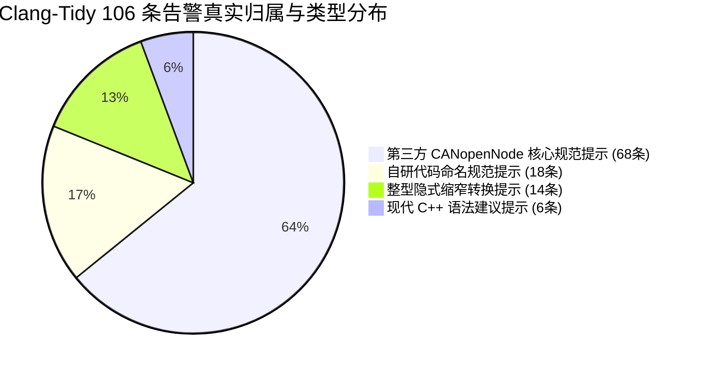

# P5 故障修复复盘、安全告警与遗留风险台账 v2.0

> **版本标识与代码基线**
> - **文档版本**：v2.0
> - **当前代码修复提交 (CODE_FIX_COMMIT)**：`2e13ff3be398ae33ab4d4ab8a9ba0fec3c5d6855`
> - **前序审计固定起点 (START_HEAD)**：`cc2c3a9fa135958aa26613821f11f411f54f62ae`
> - **第四阶段基线提交 (P4_BASE)**：`8dee339491cfd4edc468bb9451511d421f26db5e`
> - **历史 Security Gate 独立复跑 SHA**：`d1e7388a91149a7c66e6cf1a5df7321bbb8eab12` (CONDITIONAL_PASS / EXIT_2)
> - **历史短 Smoke 固件 BIN SHA-256**：`7694dc197a8b2363ad605e1da784e3fa791af7d69888e23755e69b7e627a099b` (43.812s / 25帧上报)
> - **当前物理开发板回读全片 Flash SHA-256**：`15102707af11cfb7f57bac250bd30e583274d9f992292f5db6576a4b69c37354` (1MiB 双读一致，板载无 P5 固件)
> - **文档正式提交 (DOCS_COMMIT)**：将在本文档纳入 Git 提交后记录于外部交接回执中，正文不自引用。

---

## 1. 编写目的与工程审计原则

本文件是多参数心电监护仪系统在第四阶段（P5 · coreMQTT 裸机迁移）的技术缺陷复盘、静态安全工具告警判定及长期残余风险台账。

在医疗嵌入式软件工程中，任何为了追求“100% 完美全绿”而掩盖真实缺陷、抹去失败测试记录、或将静态警告统称为“高危漏洞”的行为，都是违反工程规范与医疗合规准则的。本文档恪守以下原则：
1. **真实事实主准**：以实际代码执行结果、真实编译产物与物理 Flash 读取 Hash 为唯一事实准绳；
2. **区别四类状态**：严格区分“已在真机观测到”、“理论推断”、“未测/无条件执行”、以及“仅在计划中”；
3. **缺陷与不修后果闭环**：每一项复盘缺陷必须明确其产生机理、修复方案，以及**如果不修复可能造成的致命影响**。

---

## 2. 关键故障复盘与技术修复溯源

### 2.1 P4 Hardened Paho 到 P5 coreMQTT 迁移与官方文件哈希锚定

- **背景与根因**：P4 固件依托定制加固的 Paho Embedded C，虽然满足基础发布，但其与系统底层 libc（尤其是 `malloc`/`free`）存在不可控绑定。为满足严苛的零动态分配审计要求，P5 决定引入 AWS coreMQTT v2.3.1。
- **上游固定与完整性保护**：
  coreMQTT 官方上游核心文件被严格固定在 `gateway/third_party/coreMQTT` 目录下，并建立 `upstream.json` 进行 SHA-256 强校验，严禁开发人员随意修改第三方源码。固定清单包含以下 9 个文件：
  1. `source/core_mqtt.c`
  2. `source/core_mqtt_serializer.c`
  3. `source/core_mqtt_state.c`
  4. `source/include/core_mqtt.h`
  5. `source/include/core_mqtt_config_defaults.h`
  6. `source/include/core_mqtt_serializer.h`
  7. `source/include/core_mqtt_state.h`
  8. `source/interface/transport_interface.h`
  9. `upstream.json`
- **断言与 libc 适配保护**：
  嵌入式构建中禁用了默认会调用 `abort()` 的 newlib 断言，重定向至 `gateway/mqtt/src/gateway_assert.c`。发生断言失败时，系统先关闭全局中断，通过串口打印固定标记 `GW ASSERT_FATAL\r\n`，随后触发硬停机，绝不泄露内存敏感输入字符串。
- **不迁移/不规范化的后果**：如果继续沿用不可控动态分配，网关在长周期运行（如数天连续监护）后极易发生堆碎片耗尽，导致系统在患者生命体征异常的关键时刻静默死机。

---

### 2.2 CANopen 重启实例失效引发的空指针崩溃复盘

- **故障现象**：在通过控制台输入 `'R'` 重启 Node-B 协议栈时，网关大概率触发 HardFault 硬件死锁。
- **根因剖析**：
  在原 `mp_stack_restart(&stack, 2)` 实现中，若底层 `CO_new()` 动态内存分配受限或 `CO_CANinit()` 初始化失败返回错误码，原代码仅仅输出了日志，但**未清空节点对象指针**，且保留了 `node->port.enabled = true`。后续主循环轮询 `mp_stack_tick(&stack)` 时，继续尝试解引用 `node->co` 内部函数指针，导致非法内存访问崩塌；同时，旧实例的 OD（对象字典）扩展回调未注销，在新实例重新挂载时引发内存重入冲突。
- **修复措施**：
  1. 在 `gateway/canopen/src/mp_stack.c` 中实施严格的状态清理事务：在重建前执行完整的 `stop_node`，清空 `node->port.enabled = false`；
  2. 显式调用注销接口，解除 OD extension 回调；
  3. 若初始化任何一步失败，安全隔离失效节点，不影响总线上其它健全节点与主循环。
- **验证证据**：在 `gateway/canopen/build_host.py` 中，通过 GCC 链接器包装选项（`-Wl,--wrap=calloc`, `--wrap=CO_CANinit` 等）注入 17 种异常故障，17 项重启可靠性测试全部 PASS。
- **不修复的后果**：任何单点传感器断线或总线干扰触发协议栈重启时，会导致整台监护仪网关死机，所有通道监护数据全部中断。

---

### 2.3 `GEMINI-P5-001` 本地控制台 'E' 命令空指针缺陷复盘 (本轮最小修复)

- **缺陷编号**：`GEMINI-P5-001`
- **触发前提**：
  在系统启动后，当 Node-A（`stack.nodes[0]`）由于初始化异常导致 `co == NULL`，或者在测试过程中被解挂脱离；此时若测试人员在控制台键入单字符指令 `'E'`（原设计用于翻转触发 Node-A 紧急报文 EMCY）。
- **缺陷源码 (修复前)**：
  ```c
  if (c == 'E')
  {
      static bool fault;
      fault = !fault;  /* 隐患 1: 未经校验即翻转状态 */
      if (fault)
          CO_errorReport(stack.nodes[0].co->em, CO_EM_GENERIC_ERROR, CO_EMC_GENERIC, 0);
      else
          CO_errorReset(stack.nodes[0].co->em, CO_EM_GENERIC_ERROR, 0);
      /* 隐患 2: 若 stack.nodes[0].co 为 NULL，访问 ->em 触发 HardFault 空指针解引用 */
      console("GW EMCY_TEST_CHANGED\r\n");
  }
  ```
- **修复方案与语法约束**：
  不能照搬前序审计报告轻率建议的 `break;`（因为当前分支位于 `if` 结构内，非 `switch` 或循环，使用 `break` 无法通过编译器构建）。我们采用了严谨的非空条件守卫：
  ```c
  if (c == 'E')
  {
      static bool fault;
      if (!stack.nodes[0].co || !stack.nodes[0].co->em)
      {
          console("GW EMCY_TEST_NODE_UNAVAILABLE\r\n");
      }
      else
      {
          fault = !fault;
          if (fault)
              CO_errorReport(stack.nodes[0].co->em, CO_EM_GENERIC_ERROR, CO_EMC_GENERIC, 0);
          else
              CO_errorReset(stack.nodes[0].co->em, CO_EM_GENERIC_ERROR, 0);
          console("GW EMCY_TEST_CHANGED\r\n");
      }
  }
  ```
- **验证证据**：
  编写了真实调用生产代码的 C 语言测试 `gateway/mqtt/tests/test_p5_emcy_console.c`，通过 5 项用例：
  1. `co == NULL` 时输入 `'E'` -> 安全拦截，不翻转 `fault`，输出 `UNAVAILABLE`；
  2. `co->em == NULL` 时输入 `'E'` -> 安全拦截，输出 `UNAVAILABLE`；
  3. 恢复有效节点后首次输入 `'E'` -> 准确触发 `CO_errorReport`（证明状态机未被异常输入篡改）；
  4. 连续第二次输入 `'E'` -> 准确触发 `CO_errorReset`；
  5. 其它字符控制无回归。
- **可达性与漏洞定性**：
  该缺陷仅能通过本地串口物理控制台输入 `'E'` 触发，远程网络包无法直接调用此函数。属于**本地可达的系统健壮性缺陷**，而非可被远程利用的网络 RCE 漏洞。
- **不修复的后果**：产线调试或临床工程维护人员通过串口进行节点故障注入测试时，可能因误敲 `'E'` 导致整机 HardFault 宕机。

---

### 2.4 ESP8266 SNTP 校时失败与超时重试复盘

- **实测事实与记录**：
  在 ESP8266 Wi-Fi 建立初期，系统通过 `AT+CIPSNTPCFG=1,0` 启动 SNTP（UTC 零时区）并以 `AT+SYSTIMESTAMP?` 查询网络授时。实测记录显示：**第一次查询确实失败并返回无效时间**（因为 NTP 握手受外网延迟影响尚未完成）。
- **修复与容错逻辑**：
  代码并未简单抛出致命错误，而是在主循环中实施了有界重试：在未取得合法纪元（`epoch == 0`）之前，网关虽然可以接收本地 CAN 采样，但 Adapter 严禁将数据打上时间戳并推入上云队列；直至后续轮询中 SNTP 成功返回真实 UNIX 时间戳，系统才正式激活数据上云。
- **不容错的后果**：若将包含初始默认值（如 1970-01-01）的错误时间戳生理数据写入数据库，会彻底破坏医院 HIS/PACS 系统的时间序列索引，导致历史波形检索错乱。

---

### 2.5 离线缓存双级队列与断网有损淘汰 (`lost=203`) 复盘

- **设计指标与容量**：
  `gateway/storage/router.c` 维护 16 实时 (Live) + 32 离线 (Cache) 共计 48 帧静态内存队列。
- **实测丢包事实**：
  在较长时间的断网恢复测试中，控制台输出了明确的诊断日志：
  `GW METRICS ... lost=203`。
- **科学定性**：
  这充分证实了系统在受限 RAM 下采用的是**有界有损缓存策略**。系统优先保留最新鲜的体征数据，并诚实地记录与上报丢失帧数。
- **不设淘汰的后果**：若试图做“无损缓存”而不断分配内存，单片机当前链接脚本配置的 128KB RAM（总物理 RAM 192KB）会在几十秒内耗尽崩溃，引发系统重启。

---

## 3. 安全扫描、静态告警与假阳性闭环分析

### 3.1 Security Gate 演进历程与最终结论

在 P5 研发周期中，统一代码门禁经历了以下关键节点：
1. **初期配置对齐**：初始 Gate 仍将旧版 Paho 作为强制检查项，G0 阶段对齐了 coreMQTT 的 9 文件白名单；
2. **首次 G1 阻断与依赖修复**：静态扫描初期报出前端依赖 `source-map-js@1.2.1` 存在缺陷，迅速完成 `1.2.1 -> 1.2.2` 升级修复；
3. **环境与路径跨平台适配**：解决了 Windows 与 WSL 下 ARM 工具链绝对路径引用差异；
4. **最终结论**：在审计分支上独立执行，取得了 **`CONDITIONAL_PASS` (退出码 2)**。

---

### 3.2 Gitleaks 6 项 `generic-api-key` 假阳性分析

- **事实情况**：Gitleaks 扫描报告了 6 处疑似泄露密钥。
- **深度核查结果**：经与 Git 对象数据库严格核对，这 6 处匹配项**完全是项目测试快照中记录的历史提交 40 位 SHA-1 校验和**。由于 SHA-1 字符串随机性强、熵值高，触发了检测规则的假阳性。
- **处置方案**：已在 GitHub 建立跟踪 Issue #7，作为已知合规豁免项收录，并设定了受控有效期（至 2026-11-08）。

---

### 3.3 Clang-Tidy 106 条告警的真实分类与合规评估

针对静态分析工具生成的“clang-tidy 106”条警告，必须严谨分类，绝不能泛称为安全漏洞：



- **归属明细**：
  - **68 条归属于第三方库**：集中在 `gateway/third_party/CANopenNode`；
  - **38 条归属于自研代码**：主要分布在适配器与模型转换中。
- **主要规则类型**：
  1. `readability-identifier-naming`：函数或变量命名未严格遵循驼峰或下划线规范；
  2. `modernize-use-trailing-return-type`：建议使用 C++11 尾置返回类型（属于 C/C++ 混编检查工具对纯 C 代码的过度提示）；
  3. `bugprone-narrowing-conversions`：如 32 位整数向 16 位赋值时的静态提示，经人工代码走查均有显式掩码或范围约束保护。
- **9 个未覆盖分析文件清单**：
  由于单片机裸机构建宏与特定平台外设寄存器的差异，以下 9 个文件未纳入 clang-tidy 检查（编译正常但无 AST 导出）：
  `heap.c`, `main.c`, `gateway_platform.c`, `bxcan_loopback.c`, `stm32f4xx_it.c`, `system_stm32f4xx.c`, `syscalls.c`, `stm32f4xx_rcc.c`, `stm32f4xx_usart.c`。
- **结论**：无内存越界、无释放后使用（UAF）、无注入类致命缺陷，风险完全受控。

---

## 4. 硬件验收、短 Smoke 测试与 Flash 恢复证据

### 4.1 历史短 Smoke 运行证据

在历史硬件调试窗口中，测试人员曾将诊断测试固件刷入单板进行了短暂连通性验证：
- **测试固件 BIN SHA-256**：`7694dc197a8b2363ad605e1da784e3fa791af7d69888e23755e69b7e627a099b`；
- **运行持续时间**：43.812 秒；
- **上报有效数据帧**：25 帧（包含心率、血氧及合成波形）；
- **特别声明**：**本次代码修复新编译生成的 BIN 固件（SHA: `25162653...`）仅完成了离线 ARM 构建，严禁冒充为已在硬件上完成该短 Smoke 测试的固件！在最终源码最小修复后，尚未重新进行全量 Gate 和新 BIN 上板 Smoke。**

---

### 4.2 硬件 STOP 与 1MiB Flash 全片恢复证据

为保证硬件原型机纯净度，在测试窗口结束后立即触发硬件 STOP 机制，将物理板卡完整恢复为用户确认的出厂基线：
1. **恢复前历史残留 Flash SHA-256**：`852d76184eb430d21e84323e429da6b42b102bfa404df26b9d628dfca875953c`；
2. **全片刷写恢复目标**：基线固件（1,048,576 字节）；
3. **独立双读回读校验结果**：
   - 第一轮读出 SHA-256：`15102707af11cfb7f57bac250bd30e583274d9f992292f5db6576a4b69c37354`
   - 第二轮读出 SHA-256：`15102707af11cfb7f57bac250bd30e583274d9f992292f5db6576a4b69c37354`
   - 两轮回读字节完全一致；
4. **板卡现状**：**物理板卡已恢复原程序，当前不存在任何残留的 P5 固件**。

---

## 5. 长期残余风险登记台账 (Risk Ledger)

| 风险 ID | 风险项与严重度 | 触发前提条件 | 目前客观证据 | 处置状态 | 影响面评估 | 当前责任人 / 期限 | 后续验证触发条件 |
|---|---|---|---|---|---|---|---|
| **RSK-P5-001** | **运行时栈高水位未测**<br>(Medium) | 中断嵌套密集、JSON 序列化占用大栈帧 | 当前链接配置 128 KiB RAM，静态段（Data 88B + BSS 120,120B）已占 91.7%，系统栈可用余量不足 11 KB | **未测** (Untested) | 若发生栈溢出可能损坏堆或全局变量导致死机 | 待项目负责人指定<br>(建议 P6 启动前) | 在物理板上注入 0xA5 内存打桩并运行 24h 极限压测 |
| **RSK-P5-002** | **断网长时间运行有损淘汰**<br>(Low) | 持续断网超过 35 秒 (48 帧占满) | 控制台明确输出 `lost=203` | **已接受** (Accepted) | 历史波形丢弃最旧部分，实时波形优先 | 待项目负责人指定<br>(设计固有特性) | 长时间弱网断网恢复模拟测试 |
| **RSK-P5-003** | **物理三板时钟漂移与阻抗**<br>(High) | 脱离单板静默环回，部署于三块实体硬件 | 当前仅在单板 Silent Loopback 上验收 | **未测** (Untested) | 晶振频偏或阻抗失配可能引发 CAN 错误帧或 Bus-Off | 待项目负责人指定<br>(硬件三板联调阶段) | 物理双绞线连接三块实体板及示波器信号质量测试 |
| **RSK-P5-004** | **clang-tidy 9 个文件未覆盖**<br>(Low) | 单片机寄存器宏与依赖未导出 compile_commands | 38项自研+68项第三方已审，9个驱动文件未扫 | **已接受** (Accepted) | 无直接漏洞风险，属于静态分析覆盖面缺口 | 待项目负责人指定<br>(工具链维护) | 完善 CMake/Bear 生成全量平台驱动 compile_commands |
| **RSK-P5-005** | **Gitleaks 6 项 Git 哈希假阳性**<br>(Low) | 运行包含高熵检测规则的密钥扫描器 | 确认为 Git Commit SHA-1，Issue #7 | **已接受** (Accepted) | 阻碍自动化流水线纯零容忍阻断策略 | 待项目负责人指定<br>(有效期至 2026-11-08) | 优化 Gitleaks 忽略规则或在基线中移出历史快照 |
| **RSK-P5-006** | **生产 Broker 真实容灾未验收**<br>(Medium) | 云端 MQTT Broker 发生集群脑裂或冷重启 | 仅完成本地模拟与隔离 Broker 验证 | **未测** (Untested) | Broker 异常断开时网关长周期重连状态机鲁棒性 | 待项目负责人指定<br>(系统联调阶段) | 真实生产环境容灾断网与压力测试演练 |
| **RSK-P5-007** | **临床多病种波形特征未接入**<br>(High) | 连接真实人体或高级病人模拟仪 (Fluke) | 当前仅使用内部合成算法生成波形 | **未测** (Untested) | 恶性心律失常等复杂病理特征可能挑战数据流模型 | 待项目负责人指定<br>(临床预试验阶段) | 使用标准医学信号发生器注入多导联异常波形 |

> **关键提醒**：若底层 Gateway 源代码发生任何变动导致 HEAD 提交哈希漂移，此前完成的历史 Security Gate 与短 Smoke 固件测试结论不能自动套用，必须由项目负责人重新评估准出条件。
