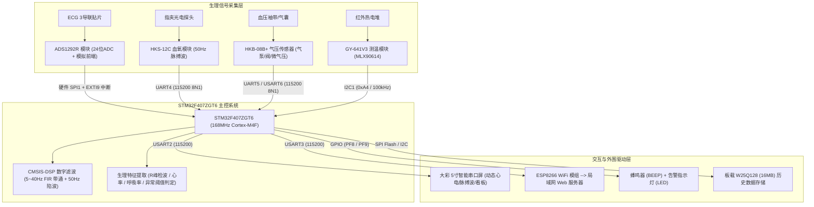
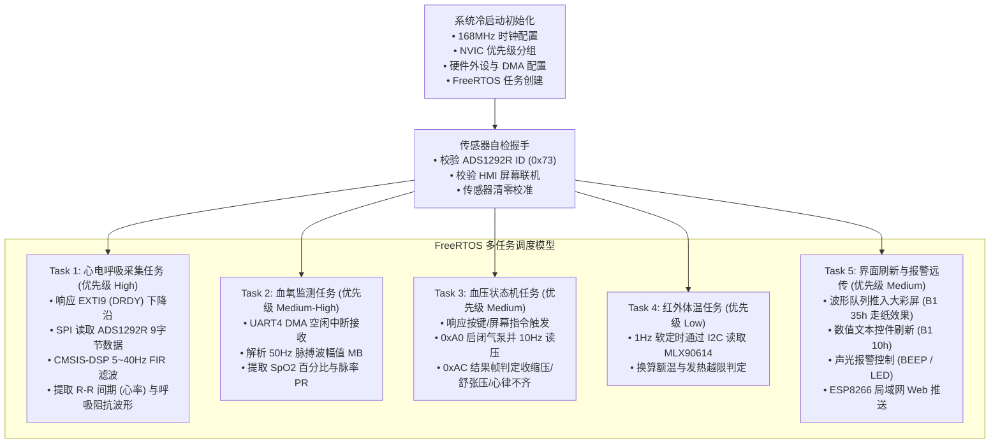

# 多参数心电监护仪系统硬件方案与元器件开发参考手册

---

## 目录
1. [项目概述与多参数系统架构](#1-项目概述与多参数系统架构)
2. [主控核心（STM32F407ZGT6）开发板资源与引脚规划](#2-主控核心stm32f407zgt6开发板资源与引脚规划)
3. [核心元器件与传感器模块深度解析](#3-核心元器件与传感器模块深度解析)
   * [3.1 ADS1292R 医用级模拟前端（心电 ECG + 呼吸阻抗 RESP）](#31-ads1292r-医用级模拟前端心电-ecg--呼吸阻抗-resp)
   * [3.2 HKS-12C 医疗级指夹式血氧饱和度模块（SpO2 + 脉率 PR）](#32-hks-12c-医疗级指夹式血氧饱和度模块spo2--脉率-pr)
   * [3.3 HKB-08B+ / HKB-08A 示波法无创血压监测模块（NIBP）](#33-hkb-08b--hkb-08a-示波法无创血压监测模块nibp)
   * [3.4 GY-641V3 / MLX90614 非接触式红外体温模块（TEMP）](#34-gy-641v3--mlx90614-非接触式红外体温模块temp)
   * [3.5 大彩 M 系列 5 寸智能串口屏（HMI 人机交互与动态曲线）](#35-大彩-m-系列-5-寸智能串口屏hmi-人机交互与动态曲线)
   * [3.6 局域网通讯扩展（ESP8266 WiFi 模组）](#36-局域网通讯扩展esp8266-wifi-模组)
4. [多任务并发软件协同流程设计](#4-多任务并发软件协同流程设计)
5. [医疗设备硬件设计与调试核心注意事项](#5-医疗设备硬件设计与调试核心注意事项)
6. [样机分阶段开发与联调推进计划](#6-样机分阶段开发与联调推进计划)

---

## 1. 项目概述与多参数系统架构

### 1.1 产品定位与核心体征参数
本系统为一款高可靠、高集成度的**多参数生理体征监护仪样机**，面向家用长期健康监护、基层诊所筛查以及病房床旁辅助监护场景。设备具有低功耗、小型化、抗干扰能力强、人机交互友好等特点，测量参数严格对标民用与基层医疗设备精度标准：

* **心电与心率（ECG / HR）**：三导联人体体表生物电采集，测量范围 30 ～ 250 bpm，精度 ±1 bpm。
* **呼吸率（RESP / RR）**：双检测机制（ADS1292R 高频呼吸阻抗调制解调 + 心电波形基线呼吸波动衍生算法），量程 8 ～ 60 次/分钟，精度 ±3 次/分钟。
* **血氧饱和度与脉率（SpO2 / PR）**：双波长光电容积脉搏波法（PPG），血氧量程 70% ～ 100%（分辨率 1%），脉率量程 47 ～ 255 bpm。
* **无创血压（NIBP）**：示波法加压与阶梯泄气测量，量程 0 ～ 300 mmHg，输出收缩压（SYS）、舒张压（DIA）、平均压（MAP）并支持心律不齐筛查。
* **红外体温（TEMP）**：非接触额温红外热辐射检测，精度 0.1 ℃，测量距离 1 ～ 3 cm。

### 1.2 系统硬件拓扑与数据链路
系统采用**“主控 MCU + 多传感前端 + 硬件信号调理 + 智能串口屏交互 + 本地告警存储 + 局域网远传”**的分层架构：

---

## 2. 主控核心（STM32F407ZGT6）开发板资源与引脚规划

系统选用 **STM32F407ZGT6** 高性能 32 位微控制器作为中央运算处理单元。

### 2.1 芯片核心规格
* **内核**：ARM 32-bit Cortex-M4 CPU，内置硬件 FPU（单精度浮点加速）与 DSP 指令集。
* **主频**：最高 **168 MHz**，运算性能达 210 DMIPS。
* **存储资源**：片内 **1024 KB Flash**，**192 KB SRAM**（128KB 系统 SRAM + 64KB CCM 内存）；板载 1MB FSMC 外部 SRAM 与 16MB SPI Flash（W25Q128）。
* **外设资源**：多达 6 路硬件串口（USART1～3，UART4～6）、3 路 SPI、3 路 I2C、外部中断控制器（EXTI）、高精度定时器群。

### 2.2 监护仪外设与 GPIO 映射分配全表

| 外设/模块 | 通信接口 | STM32 物理引脚 | 复用功能 / 硬件资源 | 功能说明与连接细节 |
| :--- | :--- | :--- | :--- | :--- |
| **ADS1292R (心电/呼吸)** | 硬件 SPI1 | `PB3` (SCK) `PB4` (MISO) `PB5` (MOSI) | SPI1 总线 (全双工主机模式) | 高速读取 24 位模数转换原始数据。 |
| | 控制 GPIO | `PD0` (CS) `PD1` (START) `PD2` (PWDN) | 推挽输出 (Pull-Up, High Speed) | `CS` 为片选，`START` 启动转换，`PWDN` 掉电/复位。 |
| | 中断信号 | `PE9` (DRDY) | EXTI9 下降沿触发中断 | 数据就绪引脚，变低电平时触发单片机读取 9 字节帧。 |
| **大彩串口屏 (HMI)** | 异步串口 | `PA2` (USART2_TX) `PA3` (USART2_RX) | USART2 (115200 8N1) | 屏幕驱动与波形下发；P3 跳线需短接 1-3、2-4。 |
| **血氧模块 (HKS-12C)** | 异步串口 | `PC10` (UART4_TX) `PC11` (UART4_RX) | UART4 (115200 8N1) | 接收 50Hz PPG 容积脉搏波幅值与血氧/脉率数据。 |
| **血压模块 (HKB-08B+)** | 异步串口 | `PC12` (UART5_TX) `PD2` (UART5_RX) 或 `PG14/PG9` | UART5 / USART6 (115200) | 控制气泵充放气，接收 10Hz 实时压力与最终测量结果。 |
| **红外体温 (GY-641V3)** | 硬件 I2C | `PB8` (I2C1_SCL) `PB9` (I2C1_SDA) | I2C1 (标准模式 100kHz) | 读取环境温 Ta、物表温 To 与人体补偿体温 Bo。 |
| **WiFi 通讯 (ESP8266)** | 异步串口 | `PB10` (USART3_TX) `PB11` (USART3_RX) | USART3 (115200 8N1) | 直插板载 P1 插座；P5 跳线短接 3-5、4-6。 |
| **声光报警系统** | GPIO 控制 | `PF8` (BEEP_CTRL) `PF9` (LED0) | 推挽输出 (S8050 驱动 / 低电平点亮) | 体征越限时驱动有源蜂鸣器发声与红灯报警。 |
| **调试 / 固件烧录** | 串口 ISP / 打印 | `PA9` (USART1_TX) `PA10` (USART1_RX) | USART1 + CH340C (COM15) | P7 跳线短接 1-3、2-4，用于终端打印与串口一键下载。 |

---

## 3. 核心元器件与传感器模块深度解析

### 3.1 ADS1292R 医用级模拟前端（心电 ECG + 呼吸阻抗 RESP）

#### 1. 芯片架构与工作机理
ADS1292R 是德州仪器（TI）专为低功耗便携式心电监护设备研发的双通道、24 位 Delta-Sigma 生物电模拟前端：
* **内部可编程增益仪表放大器（PGA）**：通道增益支持 1、2、3、4、6、8、12 倍独立可调，本方案配置心电通道增益为 6，呼吸通道增益为 12。
* **低噪声低温漂基准**：内置 2.42V 高精度内部基准电压源，温漂低至 3 ppm/℃。
* **右腿驱动网络（RLD）**：内置右腿驱动反相放大器，通过负反馈将人体感应的 50Hz 工频共模电压反向注入人体，系统共模抑制比（CMRR）高达 105 dB 以上。
* **高频呼吸调制解调器（RESP）**：内部振荡器产生高频方波载波（32kHz/64kHz），由 `RESP_MODP` / `RESP_MODN` 引脚经外围电容注入人体胸腔。胸腔随呼吸涨缩引起的阻抗微弱变化（0.1Ω 级别）调制载波幅度，芯片内部同步解调后输出呼吸波形。

#### 2. 原理图设计剖析
参考模块原理图（`ADS1292模块电路原理图.pdf`）：
* **双路低噪声电源独立隔离**：采用两颗独立的超低噪声高 PSRR LDO（`ADP150AUJZ-3.3`），分别生成模拟电源 `AVDD_3V3` 与数字电源 `DVDD_3V3`，有效抑制数字总线高频切换噪声窜入模拟微弱信号链路。
* **输入限流与差分低通滤波**：
  * 电极输入端（`ADS1292_ELA` / `ADS1292_ERA`）配备 10MΩ 高阻共模偏置电阻与 2.2nF 差分/共模滤波电容网络，滤除空间射频与高频电磁干扰；
  * 信号线串联 39kΩ 金属膜电阻，限制人体漏电流并提供除颤与静电冲击保护。
* **高速总线阻尼排阻**：SPI 通信线（SCLK、DIN、DOUT、DRDY 等）均串联 100Ω 阻尼排阻（PR1、PR2），消除高速数字信号传输线上的过冲与振铃反射。

#### 3. 驱动时序与数据帧解析
* **初始化时序**：
  1. 拉低 `PWDN` 1s 后拉高，延时 1s 待内部复位稳定；
  2. 发送 `SDATAC` 命令（`0x11`）退出连续转换模式；
  3. 读 ID 寄存器（校验返回值是否为 `0x73`，确保芯片物理连通正常）；
  4. 寄存器参数写入：
     * `CONFIG2 = 0xE0`（开启内部 2.42V 基准）；
     * `CONFIG1 = 0x01`（配置采样速率为 250 SPS）；
     * `CH1SET = 0x60`（通道 1 增益 12，用于呼吸阻抗测量）；
     * `CH2SET = 0x00`（通道 2 增益 6，用于正常心电信号测量）；
     * `RESP1 = 0xEA`, `RESP2 = 0x03`（开启内部呼吸调制解调时钟）；
  5. 发送 `RDATAC` 命令（`0x10`）重新使能连续数据读取模式，拉高 `START` 引脚启动 ADC。
* **数据读取时序**：当检测到 `DRDY` 引脚由高变低，拉低 `CS` 连续读取 9 个字节（72 位）：
  * `Byte 1 ~ 3`：状态字（含导联脱落标志位）；
  * `Byte 4 ~ 6`：通道 1（呼吸阻抗原始数据，24 位有符号数）；
  * `Byte 7 ~ 9`：通道 2（心电图原始数据，24 位有符号数）。
* **CMSIS-DSP 数字滤波算法**：
  * 心电原始信号叠加有 0.1～0.5Hz 呼吸基线漂移与 50Hz 工频噪声；
  * 采用 ARM CMSIS-DSP 库的 `arm_fir_f32`，部署 129 阶 FIR 带通滤波器（通带 5Hz ～ 40Hz，采样率 250Hz），有效滤除基线与肌电杂波；
  * 对滤波后的波形运行差分阈值法进行 R 波峰值检波，计算相邻 R-R 间期：`心率(bpm) = 60 × 250 / 采样点间隔`。

---

### 3.2 HKS-12C 医疗级指夹式血氧饱和度模块（SpO2 + 脉率 PR）

#### 1. 测量原理
* **双波长光电容积脉搏波描记法（PPG）**：
  * 人体动脉血液中包含氧合血红蛋白（`HbO2`）和还原血红蛋白（`Hb`）；
  * 探头内部集成 660 nm 红光与 940 nm 近红外光 LED 以及高灵敏度光敏二极管；
  * `Hb` 对 660 nm 红光的吸收率远高于 `HbO2`，而 `HbO2` 对 940 nm 近红外光的吸收率明显高于 `Hb`；
  * 随着心脏舒缩射血，手指末梢毛细血管容积呈现脉动性变化，透过手指的透射光产生搏动交流分量（AC）与直流分量（DC）；
  * 计算双波长吸光度比值 `R = (AC_660 / DC_660) / (AC_940 / DC_940)`，通过标定曲线换算出动脉血氧饱和度百分比（SpO2）。

#### 2. 通信协议规范（参考技术规格书第 7.3.11 节）
* **物理层**：UART TTL 串口，115200 bps，8 位数据位，1 位停止位，无校验；工作电压 5V DC。
* **帧格式说明**：
  * 固定帧头：`0xFF`
  * 设备类别标识：`0xC7`（血氧专用类别码）
  * 校验和定义：`CKSUM = (长度 + 命令 + 所有数据字节) & 0xFF`
* **交互流程**：
  1. **启动测量**：
     * 主控下发：`0xFF 0xC7 0x03 CKSUM 0xA0`
  2. **数据主动上报（50Hz 连续流）**：
     * 模块每 20 ms 主动上报一帧完整体征数据：
       `0xFF 0xC7 0x06 CKSUM 0xA0 MB XY XL`
     * `MB`（1 字节）：血容积脉搏波幅值（相对量，用于大彩串口屏动态绘制脉搏波曲线）；
     * `XY`（1 字节）：血氧饱和度数值（单位 %，正常范围 70 ～ 100；数值为 `0xFF` 表示正在检测中）；
     * `XL`（1 字节）：实时脉率数值（单位 bpm，正常范围 47 ～ 255；数值为 `0` 表示未出结果）。
  3. **停止测量**：
     * 主控下发：`0xFF 0xC7 0x03 CKSUM 0xA1`。

---

### 3.3 HKB-08B+ / HKB-08A 示波法无创血压监测模块（NIBP）

#### 1. 测量原理与硬件组成
* **示波法测量机制**：
  * 微型直流气泵向缠绕于上臂的袖带充气打压，使气囊压力高于收缩压以阻断肱动脉血流；
  * 随电磁泄气阀匀速阶梯放气（放气速率 2～4 mmHg/s），动脉血管重新充盈并在气囊内形成振荡脉搏压力波；
  * 模块内置压阻式微压传感器分离出袖带直流静压和脉冲微压交流信号；
  * 脉搏波振荡幅度达到峰值时对应的袖带静压即为**平均动脉压（MAP）**，进而通过算法比例包络阈值推导出**收缩压（高压）**和**舒张压（低压）**。
* **硬件部件**：
  * 直流气泵（`M+`、`M-`，**严禁极性反接**，否则气泵永久损坏）；
  * 电磁快速放气阀（`V+`、`V-`，常开型设计，断电立即泄气，保障电气安全）；
  * 线性漏气微孔阻尼阀与五通连接器；
  * 高精度全桥式压力传感器与仪表放大电路。

#### 2. 通信协议规范（参考产品技术规格书 V2.2）
* **物理层**：UART TTL 串口，115200 bps，8N1；工作电压 5V DC，气泵打气电流峰值达 350 ～ 500 mA。
* **数据帧结构**：
  * 固定双帧头：`0xFF 0xC0`
  * **紧急强制复位指令**：`0xFF 0x00`（无帧头，仅 2 字节，立即停泵并开阀放气，最高优先级）。
* **测量流程与数据帧**：
  1. **启动血压测量**：
     * 主机发送：`0xFF 0xC0 0x03 CKSUM 0xA0`
     * 充气加压过程中，传感器按 10Hz 回复实时袖带压力帧：
       `0xFF 0xC0 0x05 CKSUM 0xA0 QYH QYL`
       其中实时袖带压力值 = `(QYH & 0x0F) * 256 + QYL`（单位 mmHg）；
       `QYH.4 = 1` 表示捕捉到有效脉搏跳动，`QYH.4 = 0` 表示未检出。
  2. **测量完成最终结果帧**：
     * 传感器主动上报：`0xFF 0xC0 0x08 CKSUM 0xAC SSYH SSYL SZYH SZYL XL`
     * `SSY`（收缩压）：`SSYH * 256 + SSYL`（**若 `SSYH.7 = 1`，则代表检出心律不齐！**）；
     * `SZY`（舒张压）：`SZYH * 256 + SZYL`；
     * `XL`（心率/脉率）：直接指示脉搏心率（bpm）。
  3. **故障与异常告警帧**：
     * 传感器上报：`0xFF 0xC0 0x04 CKSUM 0xAD X`
     * `X = 0`：未检测到有效脉搏；
     * `X = 1`：打气超时，11 秒内压力未达 50 mmHg（袖带松脱或漏气）；
     * `X = 2`：运算数值错误；
     * `X = 3`：袖带压力突破 295 mmHg 触发硬件超压强制泄气保护；
     * `X = 4`：患者体动干扰过大（测量中晃动或说话）。
  4. **终止测量**：主机发送：`0xFF 0xC0 0x03 CKSUM 0xA1`。

---

### 3.4 GY-641V3 / MLX90614 非接触式红外体温模块（TEMP）

#### 1. 测温机理与芯片结构
* **普朗克黑体辐射与斯蒂芬-玻尔兹曼定律**：物体在自然界中以红外电磁波向外辐射能量，辐射能量与其热力学温度的四次方成正比。
* **探头集成度**：搭载 Melexis 原厂 `MLX90614ESF` 传感器，内部封装了微机械加工的热电堆红外感应探头、低噪声运算放大器、17 位高精度 Delta-Sigma ADC 以及专用的数字信号处理器（DSP）。
* **测量参数**：同时输出环境参考温度（`Ta`）、目标被测辐射物温（`To`），并通过内部医学拟合补偿算法输出人体体温（`Bo`）。

#### 2. 通信协议与数据读取（支持 I2C 与 UART 两种模式）
* **I2C 总线模式（推荐，挂载于 STM32 的 I2C1 总线）**：
  * 器件从机地址：写 `0xA4`，读 `0xA5`（时钟速率 ≤ 100 kHz）；
  * 读取寄存器 `0x07`，连续获取 7 个数据字节：
    * `Byte 0`：发射率 `e`（换算公式：`e / 100.0`）；
    * `Byte 1 ~ 2`：物表温度 `To`（换算公式：`(Byte 1 << 8 | Byte 2) / 100.0`，单位 ℃）；
    * `Byte 3 ~ 4`：环境温度 `Ta`（换算公式：`(Byte 3 << 8 | Byte 4) / 100.0`，单位 ℃）；
    * `Byte 5 ~ 6`：人体补偿体温 `Bo`（换算公式：`(Byte 5 << 8 | Byte 6) / 100.0`，单位 ℃）。
* **UART 串口模式（9600 bps）**：
  * 模块自动循环上传 11 字节数据帧：`0xA4 0x03 reg len e ToH ToL TaH TaL BoH BoL sum`。

---

### 3.5 大彩 M 系列 5 寸智能串口屏（HMI 人机交互与动态曲线）

#### 1. 架构优势与交互原理
大彩 M 系列串口屏自带 Cortex 系列图像处理芯片与大容量 Flash 显存，所有页面布局、静态底图、字库、按钮图标均通过 PC 组态软件（VisualTFT）离线编译后下载至屏端。单片机主控仅需通过串口发送轻量级的控制指令，即可实现界面毫秒级渲染与波形绘制，极大减轻了单片机内核负担。

#### 2. 核心指令集规范（参考大彩串口屏指令集 V5.1）
* **帧格式规范**：
  * 帧头：`0xEE`
  * 帧尾：`0xFF 0xFC 0xFF 0xFF`
* **常用组态指令表**：

| 功能操作 | 十六进制指令格式 | 说明与示例 |
| :--- | :--- | :--- |
| **切换画面** | `EE B1 00 SCREEN_ID(2B) FF FC FF FF` | 切换到主监护页面 1：`EE B1 00 00 01 FF FC FF FF` |
| **数值/文本更新** | `EE B1 10 SCREEN_ID(2B) CONTROL_ID(2B) STR... FF FC FF FF` | 刷新心率值 "75"：`EE B1 10 00 01 00 05 37 35 FF FC FF FF` |
| **波形末尾追加采样点** | `EE B1 35 SCREEN_ID(2B) CONTROL_ID(2B) CH(1B) LEN(2B) DATA... FF FC FF FF` | **用于动态心电与脉搏波平滑走纸绘制**：新采样点从右侧压入，旧数据自动左移平移。 |
| **清空曲线数据** | `EE B1 33 SCREEN_ID(2B) CONTROL_ID(2B) CH(1B) FF FC FF FF` | 切换导联或重新测量时清空波形画布。 |
| **触摸按键事件上报** | `EE B1 11 SCREEN_ID(2B) CONTROL_ID(2B) TYPE(1B) STATUS(1B) FF FC FF FF` | 屏幕主动发送至单片机：用户点击了“开始测血压”、“停止报警”等控件。 |

---

### 3.6 局域网通讯扩展（ESP8266 WiFi 模组）
* 模块直插板载 **P1 插座**，通过 **USART3（PB10/PB11）** 进行 AT 指令交互；
* 系统通过 TCP Client / WebSocket 将单片机解析打包的 5 维体征数据帧（`JSON` 格式）实时推送到局域网 PC/平板的 Web 监护大屏，实现远程集中监护与数据可视化。

---

## 4. 多任务并发软件协同流程设计

监护仪涉及多速率并发采集（心电 250Hz、血氧 50Hz、血压 10Hz 状态机、体温 1Hz），建议采用 **FreeRTOS** 操作系统管理任务调度：

---

## 5. 医疗设备硬件设计与调试核心注意事项

> [!CAUTION]
> **电源与电气安全红线：严禁在连接人体测试心电时使用市电开关电源！**
> 市面上常见的开关电源适配器内部存在高频斩波与工频漏电流，微弱的心电信号（通常仅 0.1mV ～ 4mV）会被强大的 50Hz 工频和开关杂波淹没，更存在电击安全隐患。
> * **供电规范**：测试人体心电时，**必须使用电池组（如 2S/3S 锂电池配合低噪声线性稳压降压）或充电宝供电**，实现系统电气浮地；
> * **强弱电隔离**：血压模块的气泵和电磁阀属于感性大电流负载（瞬间打气电流达 500mA），必须与微控制器核心 3.3V 及 ADS1292R 模拟电源完全隔离，并在气泵两端反向并联续流二极管（如 SS34 / 1N4007），防止反向电动势击穿主控芯片或引起基准电压跌落复位。

### 5.1 患者安全与电气防护（BF / CF 级标准）
* **微安级漏电流限制**：电极接口串联 39kΩ 金属膜电阻与 TVS 瞬态二极管，限制单故障状态下流入人体的漏电流不超过 10 μA；
* **右腿驱动良好导通**：人体右腿/右下腹必须可靠贴附 RL 电极，否则共模电压无法抵消，会导致波形上下剧烈漂移。

### 5.2 传感器规范操作与常见故障排查
1. **心电电极片佩戴**：
   * 必须选用医用一次性银/氯化银（Ag/AgCl）导电水凝胶电极片；
   * 贴放前需使用医用酒精棉片擦拭皮肤，去除角质与皮脂（绿线接右上胸/右腕 RA，黄线接左下肋/左踝 LA，红线接右下腹/右踝 RL）。
2. **血压袖带缠绕规范**：
   * 袖带下沿距肘窝 2 ～ 3 cm，松紧度以能插入一根手指为准；
   * 气管必须平整无折叠，气路五通与接头必须保证密封，否则会因 11 秒无法打气升至 50mmHg 而报出 `X=1` 错误代码。
3. **红外测温对准**：
   * 测温探头中心轴线须垂直对准额头中心，距离保持在 **1 ～ 3 cm** 范围内，避免发丝遮挡与汗水挥发吸热导致测温偏低。
4. **血氧弱灌注处理**：
   * 手指冰凉、探头夹入过浅或涂抹深色指甲油会导致光电信号严重衰减（弱灌注），模块将上报 `XY = 0xFF` 无法计算；测量前需揉搓手指使其温热充血。

---

## 6. 样机分阶段开发与联调推进计划

* **阶段一：单传感器底层驱动打通（第 1 ～ 2 周）**
  * 配置 SPI1 与 EXTI9 中断，实现 ADS1292R 寄存器配置及 9 字节原始数据稳定读取；
  * 配置 UART4、UART5 及 I2C1，分别验证血氧模块、血压模块与红外体温模块的数据校验与解析；
  * 通过主串口（COM15）打印生理数据，验证测量准确度。
* **阶段二：DSP 滤波算法与体征特征提取（第 3 周）**
  * 引入 ARM CMSIS-DSP 库，部署 5～40Hz FIR 带通滤波器消除基线与肌电干扰；
  * 编写峰值检波算法计算心率（HR）；从通道 1 提取阻抗呼吸波并计算呼吸率（RR）。
* **阶段三：大彩串口屏 UI 联动与本地业务闭环（第 4 周）**
  * 使用 VisualTFT 设计 5 寸监护仪专业 UI（ECG/PPG 动态走纸曲线控件、体征数值大字看板、报警阈值弹窗）；
  * 单片机通过串口 2 使用 `0xB1 0x35` 指令平滑推送实时波形，建立声光报警机制。
* **阶段四：网络推送与系统集成验证（第 5 周）**
  * 驱动 ESP8266 模块通过 TCP/WebSocket 协议将体征数据上传至局域网服务器；
  * 开展整机锂电池供电下的长时间稳定性、电磁兼容性（EMC）与抗干扰联合测试。
