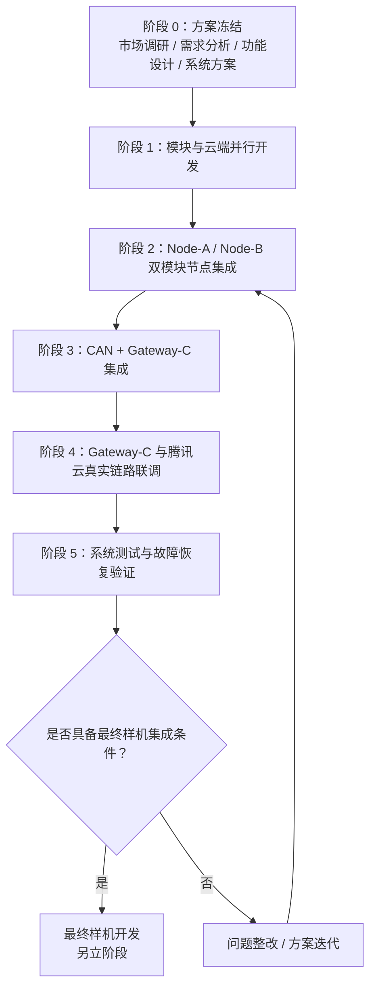
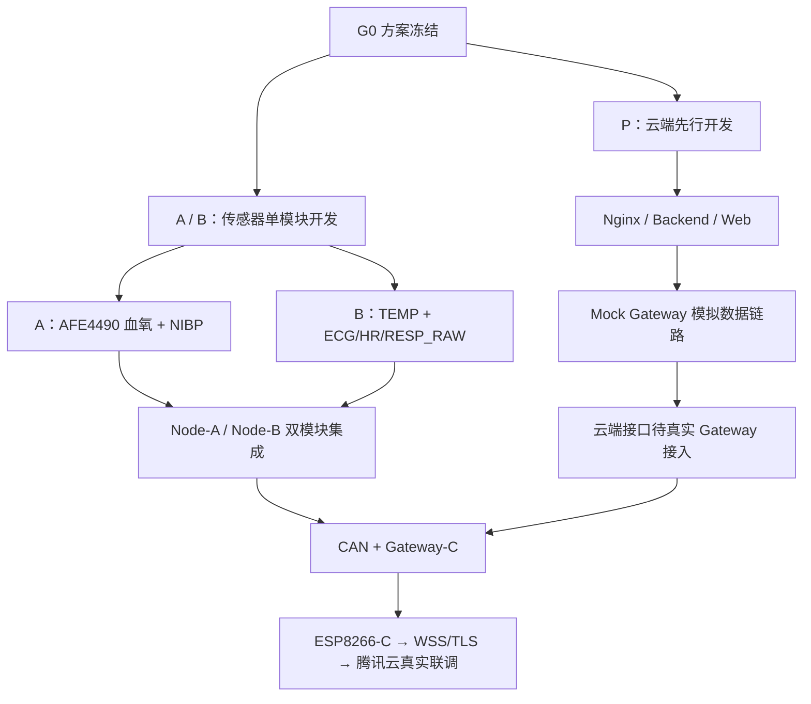
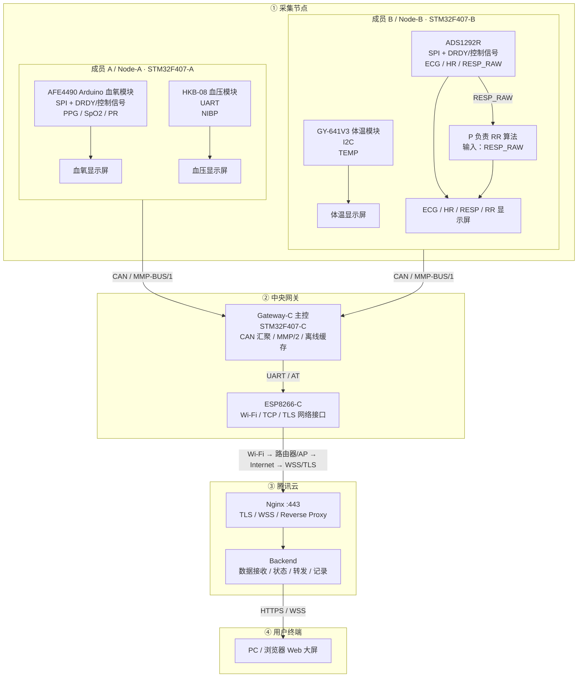

# 多参数生理监护系统总开发合同与系统方案

> **文件编号**：MMP-SOW-006  
> **版本**：v0.6（系统方案修订版）  
> **日期**：2026-09-19  
> **代码仓库**：`Serendipity-min/medical-multi-parameter-monitor`（Private）  
> **适用阶段**：市场调研 → 需求分析 → 功能设计 → 系统方案设计 → 软硬件设计 → 模块开发 → 系统集成 → 测试验证 → 样机开发（暂定）  
> 
> **说明**：本版本定位为“系统方案与任务合同”，只冻结系统架构、模块责任、接口类型、通信层次、开发流程和验收要求；**不在本阶段提前冻结字节级通信帧、RTOS/裸机实现方式、线程/任务划分、具体缓存长度等实现细节**。相关细节在模块实测后进入详细设计文档。


---

# 1. 项目目标与范围

## 1.1 总体目标

开发一套可运行、可联调、可扩展的多参数生理监护工程系统，实现：

- 血氧饱和度 SpO2 / PPG / PR；
- 无创血压 NIBP；
- 体温 TEMP；
- 心电 ECG / 心率 HR；
- 呼吸阻抗波形 RESP；
- 呼吸率 RR；
- 四个模块分别具有本地显示；
- 两个采集节点通过统一板间协议汇聚；
- Gateway-C 独立完成网络上云，不依赖个人电脑常开；
- 腾讯云完成数据接收、转发、存储与网页大屏展示；
- 网络异常时具备基本离线缓存与恢复能力；
- 测试通过后再决定是否进入最终单板样机集成。

## 1.2 本阶段不强制完成的内容

以下内容不作为当前合同的必交项：

- 医疗器械注册与临床认证；
- HIS/EMR 正式医院系统接入；
- 最终产品化 PCB；
- 所有模块集成到单块 STM32F407；
- MQTT 设备侧备用链路；
- 公网远程控制血压充气、泄压等动作；
- 最终量产、试产和医疗认证。

---

# 2. 市场调研

## 2.1 调研目的

市场调研用于确认成熟多参数监护设备的共性架构与功能边界，而不是照搬商业产品全部功能。

重点关注：

- 多参数统一显示；
- 本地实时监护；
- 中央监护；
- 有线 / 无线数据传输；
- 设备在线状态；
- 历史数据与断网恢复；
- 模块化设计。

## 2.2 参考产品

| 产品 | 可借鉴能力 | 本项目对应设计 |
|---|---|---|
| 迈瑞 ePM 系列 | ECG、RESP、SpO2、NIBP、TEMP、本地显示、中央监护、联网 | 四参数模块 + RR + 本地屏 + 云端 Web |
| Philips IntelliVue MX400 | 多参数聚合、模块化、中央信息系统连接 | 统一协议和 Gateway 汇聚 |
| EDAN iM Series | ECG、RESP、SpO2、NIBP、TEMP、LAN/Wi-Fi、中央站 | 两采集节点 + Gateway + 云端展示 |

参考官方资料：

- Mindray ePM：`https://www.mindray.com/cn/products/patient-monitoring/sub-intensive-care-monitoring/epm-10-12-15`
- Philips IntelliVue MX400：`https://www.philips.com.cn/healthcare/product/HC866060/intellivue-mx400`
- EDAN iM Series：`https://www.edan.com/product/m/PM_iM_Series_(iM80/70/60/50).html`

## 2.3 市场调研结论

本项目定位为：

> **多参数生理信号采集 + 模块本地显示 + MCU 中央汇聚 + 云端实时 Web 监护的工程验证平台。**

项目评价重点放在：

1. 模块能否稳定采集；
2. 多模块能否并行；
3. 数据能否标准化汇聚；
4. 网络中断能否识别和恢复；
5. 云端展示是否稳定；
6. 系统是否具备继续集成为样机的基础。

---

# 3. 需求分析

## 3.1 已确认的团队责任

### 成员 A

负责：

- 血氧模块：SpO2 / PPG / PR；
- 血压模块：NIBP；
- 对应两块本地显示屏；
- Node-A STM32F407；
- Node-A 与 Gateway-C 的 CAN 接口；
- ESP8266-A 独立调试与后续冷备用接口。

### 成员 B

负责：

- 体温模块：TEMP；
- 心率/ECG 模块：ADS1292R；
- ECG / HR；
- ADS1292R 的呼吸阻抗原始数据 `RESP_RAW` 可靠采集；
- 对应两块本地显示屏；
- Node-B STM32F407；
- Node-B 与 Gateway-C 的 CAN 接口；
- ESP8266-B 独立调试与后续冷备用接口。

### 项目负责人 P

负责：

- 项目总体规划与任务管理；
- 系统架构；
- 呼吸率 RR 算法；
- Gateway-C；
- MMP-BUS/1、MMP/2、MVIEW/1 协议规划；
- ESP8266-C 网络接入；
- 腾讯云与 Nginx；
- 后端服务；
- Web 监护大屏；
- Gateway 离线缓存；
- 系统集成；

## 3.2 呼吸率责任边界

呼吸率不是独立新增传感器。

数据来源为：

```text
ADS1292R 心率/ECG 模块
        ↓
呼吸阻抗原始通道 RESP_RAW
        ↓
成员 B 保证原始数据可靠采集
        ↓
P 负责 RR 算法设计、验证与版本管理
        ↓
验证后的算法集成至 Node-B
        ↓
输出 RESP 波形 + RR
```

责任冻结为：

| 工作 | 负责人 |
|---|---|
| ADS1292R 硬件和驱动 | B |
| RESP_RAW 采集 | B |
| RESP_RAW 数据接口 | B |
| RR 算法设计 | P |
| RR 算法参考实现 | P |
| RR 算法验证 | P |
| RR 算法集成到 Node-B | B 配合，P 验收 |
| RR 本地显示 | B |
| RR 云端展示 | P |

---

# 4. 功能设计

## 4.1 Node-A

Node-A 负责成员 A 的两个模块：

```text
Node-A / STM32F407-A
├── AFE4490 Arduino 血氧模块
│   ├── Red / IR 原始采样
│   ├── PPG
│   ├── SpO2
│   └── PR
│
├── 血压模块
│   ├── 测量状态
│   ├── 实时压力
│   ├── SYS
│   ├── DIA
│   └── PR / Error
│
├── 血氧独立显示屏
├── 血压独立显示屏
├── CAN → Gateway-C
└── ESP8266-A（调试 / 冷备用预留）
```

## 4.2 Node-B

Node-B 负责成员 B 的两个实体模块，同时运行 P 提供的 RR 算法：

```text
Node-B / STM32F407-B
├── 体温模块
│   └── TEMP
│
├── ADS1292R 心率/ECG模块
│   ├── ECG
│   ├── HR
│   └── RESP_RAW
│
├── P 负责的 RR 算法
│   └── RESP_RAW → RR
│
├── 体温独立显示屏
├── ECG / HR / RESP / RR 显示屏
├── CAN → Gateway-C
└── ESP8266-B（调试 / 冷备用预留）
```

## 4.3 Gateway-C

Gateway-C 负责：

- 接收 Node-A、Node-B 数据；
- 统一设备状态；
- 统一数据格式；
- 识别节点离线；
- 数据上传；
- 断网缓存；
- 网络恢复后的历史数据补传；
- 与腾讯云建立安全连接。

Gateway-C **不重新执行血氧、血压、ECG、体温等传感器底层解析**。

## 4.4 云端与网页

云端负责：

- Gateway 身份识别；
- 数据接收；
- 实时转发；
- 状态管理；
- 必要的数据记录；
- 浏览器实时监护；
- 历史记录与后续扩展。

---

# 5. 总体开发流程

## 5.1 项目阶段总览

为避免横向流程图过长，本项目采用分阶段纵向展示：



## 5.2 阶段 1 并行开发方式

传感器开发和云端开发互不等待，可同步推进：



因此 P **无需等待 A/B 完成传感器**。在真实 Gateway-C 尚未完成前，由 Mock Gateway 产生模拟 ECG、PPG、SpO2、NIBP、TEMP、RR 和节点状态数据，先把 Nginx、Backend、WebSocket 和 Web 大屏打通。后续只需要把模拟数据源替换为 Gateway-C 的 MMP/2 数据源。

## 5.3 开发原则

项目采用：

> **方案先冻结；硬件模块与云端可并行；单模块先打通；再双模块节点；再 Gateway 汇聚；最后真实设备上云和整体测试。**

禁止在没有单模块测试依据的情况下，同时调试四个传感器、CAN、ESP8266 和云端真实链路。


---

# 6. 系统方案设计

## 6.1 正常工作主链路

系统按四个逻辑区域排列：**采集节点 → 中央网关 → 云端 → 浏览器终端**。



主数据路径按顺序理解为：

```text
Node-A / Node-B
        ↓  CAN
STM32F407-C（Gateway-C 主控）
        ↓  UART / AT
ESP8266-C（Gateway-C 的网络接口）
        ↓  Wi-Fi
路由器 / AP
        ↓  Internet + WSS/TLS
腾讯云 Nginx
        ↓
Backend
        ↓
PC / Browser Web 大屏
```

其中 **Gateway-C 是一个网关节点，STM32F407-C 是网关主控，ESP8266-C 是其网络通信模块**。ESP8266-C 不是独立于 Gateway-C 的第四个采集节点。


## 6.2 系统层次

系统分为五层：

```text
传感器层
    ↓
Node-A / Node-B 采集与本地显示层
    ↓
CAN 板间通信层
    ↓
Gateway-C 网络网关层
    ↓
腾讯云 + Web 应用层
```

这样可以保证：

- 本地显示不依赖云端；
- PC 不是系统网关；
- Gateway-C 是正常网络出口；
- Node-A/B 与云端实现解耦；
- 后续最终样机集成时，上层协议和 Web 架构可以继续复用。

---

# 7. 软硬件接口设计

本阶段只冻结接口类型，不冻结具体任务调度方式。

## 7.1 Node-A 接口

| 模块 | 主要接口 |
|---|---|
| AFE4490 Arduino 血氧模块 | **SPI + DRDY/控制信号** |
| 血压 HKB-08 | UART |
| 两块本地显示屏 | UART |
| Gateway-C | CAN |
| ESP8266-A | UART |

AFE4490 已正式替代此前的 AFE4490 SPI 方案。当前只冻结接口关系：

```text
指夹血氧探头
    ↓
AFE4490 模拟前端
    ↓ SPI + 数据就绪/控制信号
STM32F407-A
    ↓
PPG / SpO2 / PR
```

AFE4490 是血氧模拟前端，Node-A 需要读取红光/红外采样并形成 PPG、SpO2 和 PR。具体寄存器、采样时序和算法参数进入成员 A 的《AFE4490 血氧模块详细设计与测试记录》，不在总合同中提前冻结。


## 7.2 Node-B 接口

| 模块 | 主要接口 |
|---|---|
| ADS1292R | SPI + DRDY/控制信号 |
| 体温 GY-641V3 | I2C |
| 两块本地显示屏 | UART |
| Gateway-C | CAN |
| ESP8266-B | UART |

其中：

- ADS1292R 提供 ECG/HR 所需数据；
- ADS1292R 同时提供 RESP_RAW；
- RESP_RAW 是 P 的 RR 算法输入。

## 7.3 Gateway-C 接口

| 对象 | 主要接口 |
|---|---|
| Node-A | CAN |
| Node-B | CAN |
| ESP8266-C | UART |
| 腾讯云 | 通过 ESP8266-C 建立 WSS/TLS 网络连接 |
| 离线缓存 | 优先使用现有板载存储资源，具体容量在详细设计阶段确认 |

## 7.4 软件框架原则

本系统方案阶段 **不强制指定 FreeRTOS 或裸机**。

只要求软件最终满足：

- 多模块并行采集；
- 显示不阻塞传感器采集；
- CAN 通信不影响采集；
- 网络故障不影响本地监护；
- 错误状态可以恢复；
- 可完成规定的稳定性测试。

具体软件框架由成员在详细设计阶段根据模块代码、开发板资源和实测结果确定，并提交模块设计说明。

---

# 8. 通信协议总体规划

本合同只冻结协议层次与用途，**具体字节帧格式另行形成《通信协议详细设计说明》并在实物联调后冻结**。

## 8.1 协议分层

```text
传感器厂家协议
        ↓
Node 驱动层
        ↓
统一生理参数与状态
        ↓
MMP-BUS/1 over CAN
        ↓
Gateway-C
        ↓
MMP/2 over WSS/TLS
        ↓
Backend
        ↓
MVIEW/1
        ↓
Web Browser
```

## 8.2 传感器厂家协议

厂家原始接口只存在于对应 Node 内部。

当前接口基线：

- AFE4490 Arduino 血氧模块：**SPI + 数据就绪/控制信号**；
- ADS1292R：SPI + DRDY/控制信号；
- HKB-08：UART；
- GY-641V3：I2C。

成员 A 的模块层需要完成 AFE4490 初始化、红光/红外数据获取以及 PPG / SpO2 / PR 结果形成；进入 MMP-BUS/1 后只传统一生理参数与状态，不向 Gateway-C 暴露 AFE4490 寄存器级协议。

Gateway-C 和云端不直接解析任何传感器私有协议。

## 8.3 MMP-BUS/1

用途：

> Node-A / Node-B 与 Gateway-C 之间的统一板间通信协议。

传输方式：

> **CAN**

协议至少需要表达：

- Node 来源；
- 数据类型；
- 数据值 / 波形；
- 数据有效状态；
- 数据序号；
- 设备健康状态；
- 必要的时间信息。

需要支持的数据类型包括：

- ECG；
- HR；
- RESP；
- RR；
- PPG；
- SpO2；
- PR；
- NIBP；
- TEMP；
- Node 状态；
- Fault / Alarm。

**当前合同不冻结 CAN ID 和 8 字节 Payload 布局。**

CAN ID、拆帧方式、发送周期等由 P 统一制定详细协议，A/B 按同一版本实现。

## 8.4 MMP/2

用途：

> Gateway-C 到腾讯云的统一设备通信协议。

承载方式：

> **WSS / TLS**

协议至少需要表达：

- Gateway；
- Node；
- 数据流类型；
- 序号；
- 时间；
- 数据有效性；
- 实时数据 / 补传数据；
- Payload；
- 完整性检查；
- 版本号。

设计原则：

1. 不依赖固定 IP 判断设备身份；
2. 网络断线后可恢复；
3. 重复数据可识别；
4. 历史补传与实时数据能够区分；
5. 协议可以继续支持未来最终单板样机。

**当前系统方案不冻结 MMP/2 的固定 Header 长度、字段 Offset 和具体字节排列。**

## 8.5 MVIEW/1

用途：

> 云端 Backend 到浏览器之间的展示协议。

原则：

- 数值与状态可采用 JSON；
- 高频波形可采用二进制 WebSocket；
- 浏览器不解析厂家协议；
- 浏览器不直接连接 STM32/ESP8266。

---

# 9. 呼吸率 RR 设计

## 9.1 数据来源

RR 原始数据明确来源于成员 B 所负责的 **ADS1292R 心率/ECG 模块中的呼吸阻抗原始通道**。

```text
ADS1292R
   ↓
RESP_RAW
   ↓
P 的 RR 算法
   ↓
RESP / RR
```

因此：

- B 不需要额外采购独立呼吸传感器；
- B 负责保证 RESP_RAW 可用；
- P 负责将 RESP_RAW 转换为 RR。

## 9.2 P 的 RR 工作内容

P 负责：

1. 对 RESP_RAW 进行数据分析；
2. 设计必要的预处理；
3. 设计呼吸周期检测方法；
4. 输出 RR；
5. 对无效信号、导联脱落和明显异常数据进行质量判断；
6. 先建立 PC/Python 参考算法；
7. 再形成可在 STM32 上运行的算法版本；
8. 与 B 共同完成 Node-B 集成；
9. 负责最终算法验收。

本阶段不在总合同中提前冻结：

- 滤波器具体阶数；
- FFT 窗口长度；
- 峰值阈值；
- RR 最终算法参数。

这些内容由 P 在取得真实 RESP_RAW 数据后形成《RR 算法设计与验证报告》。

---

# 10. Gateway-C 与云端设计

## 10.1 Gateway-C

Gateway-C 是正常运行时唯一的公网出口。

```text
Node-A ─┐
        ├── CAN → Gateway-C → ESP8266-C → Cloud
Node-B ─┘
```

职责：

- 聚合两节点数据；
- 识别节点状态；
- 执行 MMP/2；
- 管理网络连接；
- 断网缓存；
- 恢复后的补传。

## 10.2 腾讯云

使用现有腾讯云服务器与域名资源。

架构：

```text
Gateway-C
    ↓
ESP8266-C
    ↓
WSS / TLS
    ↓
Nginx :443
    ↓
Backend
    ↓
Web Browser
```

## 10.3 Nginx

继续采用 Nginx 反向代理。

职责：

- HTTPS；
- TLS；
- WebSocket 反向代理；
- 前端静态页面；
- Backend API 转发；
- 基本访问控制与日志。

公网原则：

- 80：HTTPS 跳转 / 证书验证；
- 443：HTTPS / WSS；
- Backend、数据库、设备裸 TCP 端口不直接暴露公网。

---

# 11. Gateway-C 离线缓存

## 11.1 目标

应对：

- WAN 临时中断；
- 路由器重启；
- 腾讯云短时不可达；
- Nginx / Backend 临时维护。

## 11.2 工作逻辑

```text
网络正常
  ↓
实时上传

网络中断
  ↓
Gateway-C 本地缓存

网络恢复
  ↓
实时数据继续优先上传
  +
历史缓存低优先级补传
```

MMP/2 必须能区分：

```text
LIVE
REPLAY
```

具体缓存容量、Flash 布局和记录格式在 Gateway-C 详细设计阶段确定。

---

# 12. 备用方案

## 12.1 A/B ESP8266 WSS 冷备用

正常模式：

```text
Node-A ─┐
        ├── CAN → Gateway-C → ESP-C → Cloud
Node-B ─┘
```

若 Gateway-C 故障，后续可启用：

```text
Node-A → ESP-A ─┐
                ├── WSS/TLS → Cloud
Node-B → ESP-B ─┘
```

该方案本期：

> **保留接口与软件扩展位置，不作为一期强制完成项。**

## 12.2 MQTT

当前不增加 MQTT 作为公网备用协议。

原因：

- 与 WSS 共用 Wi-Fi/公网时不能解决主要故障域；
- 增加第二套协议会提高系统复杂度；
- 当前设备规模没有必要引入 Broker；
- 可在未来 ESP32 / Linux Gateway 或云端服务解耦阶段重新评估。

---

# 13. 时间节点与里程碑

本阶段推荐按照 **10 个工作周**规划。P 的云端工作从项目早期并行启动，不等待传感器全部完成。

| 时间 | 阶段 | A / B 主要工作 | P 主要工作 |
|---|---|---|---|
| **W1** | G0：方案冻结 | 实物/BOM/接口确认 | 总体方案、云端环境与 Mock Gateway 规划 |
| **W2-W3** | G1：并行开发 | A：AFE4490 血氧 + NIBP；B：TEMP + ECG/HR/RESP_RAW；四块屏初步 | **Nginx + Backend + Web + Mock Gateway 第一版** |
| **W3-W4** | G2：RR / 云端完善 | B 提供 RESP_RAW | RR 第一版；模拟多参数数据打通云端大屏 |
| **W4-W5** | G3：双节点 | Node-A / Node-B 双模块 + 双屏 | 云端接口稳定、准备 Gateway-C |
| **W6** | G4：网关汇聚 | A/B 接入 CAN | Gateway-C + MMP-BUS/1 |
| **W7** | G5：真实设备上云 | 联调配合 | ESP8266-C + MMP/2 + WSS 接入已完成云端 |
| **W8** | G6：系统完善 | 模块问题整改 | 记录、状态、Web 展示完善 |
| **W9** | G7：故障与缓存 | 节点故障测试 | Gateway 离线缓存 / 网络恢复 |
| **W10** | G8：系统验收 | 综合测试 | 24h 稳定性、总验收、后续样机评审 |
| **后续暂定** | G9：样机开发 | 根据测试结果决定 | 另立计划 |


---

# 14. 测试验证

## 14.1 单模块测试

每个模块首先独立验证：

- 能正常通信；
- 能获取真实数据；
- 异常状态可以识别；
- 本地显示正常；
- 连续运行无明显异常。

## 14.2 Node-A 测试

验证：

```text
AFE4490 血氧 + 血压 + 两块屏 + CAN
```

关注：

- 两模块能并行工作；
- 两块屏互不影响；
- CAN 发送不影响传感器采集。

## 14.3 Node-B 测试

验证：

```text
体温 + ECG/HR/RESP_RAW + RR + 两块屏 + CAN
```

关注：

- ECG 连续性；
- HR；
- RESP_RAW；
- P 的 RR 算法；
- 两屏同时工作；
- RR 无效状态是否正确。

## 14.4 Gateway 测试

验证：

- 两个 Node 同时在线；
- 单个 Node 掉线；
- CAN 通信中断与恢复；
- ESP8266-C 重连；
- 云端短时不可用；
- Gateway 缓存；
- LIVE / REPLAY 区分。

## 14.5 云端与 Web 测试

验证：

- Nginx；
- WSS；
- Backend；
- Web 波形；
- 参数显示；
- Node 在线/离线；
- 浏览器重连；
- PC 关闭后系统继续采集与上传。

## 14.6 稳定性测试

最终至少完成一次：

> **24 小时连续运行测试**

重点记录：

- STM32 是否异常复位；
- CAN 是否中断；
- ESP8266 是否异常重启；
- 云端是否掉线；
- 自动重连是否成功；
- 数据是否出现明显缺失；
- Web 是否可重新连接。

---

# 15. 阶段文档清单

文档不追求数量，而要求关键决策可追溯。

| 阶段 | 必交文档 |
|---|---|
| G0 | 《总开发合同与系统方案 v0.6》、BOM/实物确认表 |
| G1 | A/B 各自《单模块开发与测试记录》 |
| G2 | P《呼吸率 RR 算法设计与验证报告》 |
| G3 | 《Node-A 设计说明》《Node-B 设计说明》 |
| G4 | 《MMP-BUS/1 通信协议详细设计》 |
| G5 | 《Gateway-C 与 MMP/2 通信协议详细设计》 |
| G6 | 《腾讯云/Nginx/Web 部署说明》 |
| G7-G8 | 《系统集成测试报告》《24h 稳定性测试报告》 |
| G9 | 若进入样机阶段，再制定《最终样机集成方案》 |

---

# 16. 项目分工总表

| 工作内容 | P | A | B |
|---|:---:|:---:|:---:|
| 市场调研 / 需求 / 总体方案 | **主责** | 配合 | 配合 |
| 血氧 SpO2/PPG/PR | 验收 | **主责** | - |
| 血压 NIBP | 验收 | **主责** | - |
| 体温 TEMP | 验收 | - | **主责** |
| ECG/HR | 验收 | - | **主责** |
| RESP_RAW | 接口验收 | - | **主责采集** |
| RR 算法 | **主责** | - | 集成配合 |
| 四块本地显示屏 | 总体验收 | A 两块 | B 两块 |
| CAN / MMP-BUS/1 | **协议主责** | 实现 | 实现 |
| Gateway-C | **主责** | 配合 | 配合 |
| ESP8266-C | **主责** | - | - |
| MMP/2 | **主责** | 配合 | 配合 |
| Nginx / Backend / Web | **主责** | - | - |
| Gateway 离线缓存 | **主责** | - | - |
| 系统测试 | **主责组织** | 执行 | 执行 |
| 最终样机决策 | **组织评审** | 参与 | 参与 |

---

# 17. 验收条件

当前阶段完成必须达到：

```text
血氧模块独立工作
血压模块独立工作
体温模块独立工作
ECG/HR 模块独立工作
RESP_RAW 可稳定获得
P 的 RR 算法完成初步验证
四块显示屏工作
Node-A 双模块并行
Node-B 双模块并行
Node-A/B 通过 CAN 汇聚 Gateway-C
Gateway-C 经 ESP8266-C 稳定上云
Nginx / Backend / Web 大屏正常
网络中断可以恢复
Gateway 离线缓存基本可用
24h 综合稳定性测试完成
```

满足以上条件后，召开阶段评审。

评审结果可以是：

```text
A. 进入最终单板样机集成
B. 保持当前分布式结构继续优化
C. 更换部分传感器 / 通信方案后再评审
```

---

# 18. 变更管理

以下变更需要由 P 记录并由团队确认：

- AFE4490 血氧模块或血氧算法方案发生重大变化；
- CAN 更换为 RS485/UART；
- STM32F407 更换型号；
- ESP8266 更换为 ESP32；
- 四块屏连接方式变化；
- RR 原始数据来源变化；
- 设备侧引入 MQTT；
- 开放公网控制功能；
- 进入最终单板样机阶段；
- MMP-BUS/1 或 MMP/2 的不兼容版本升级。

---

# 19. 最终样机阶段（暂定）

当前不预先规定最终整机必须：

```text
1 × STM32F407
4 × Sensor
1 × Screen
1 × ESP8266
```

是否采用上述或其他形式，由当前分布式开发和测试结果决定。

最终样机重点评估：

- 四模块能否在单 MCU 上稳定运行；
- 串口/SPI/I2C/CAN 等资源是否满足；
- 显示形式；
- 功耗与供电；
- 电气干扰；
- 软件复杂度；
- 是否值得进行硬件整合。

只有评审通过后才进入样机详细设计。

---

# 附录 A：本版本冻结结论

1. 成员 A：血氧 + 血压；
2. 成员 B：体温 + 心率/ECG模块；
3. ADS1292R 的 RESP_RAW 由 B 负责可靠采集；
4. P 负责呼吸率 RR 算法；
5. RR 算法验证后集成到 Node-B；
6. 四模块各使用一块本地显示屏；
7. Node-A / Node-B 通过 CAN 汇聚至 Gateway-C；
8. Gateway-C 使用 STM32F407；
9. Gateway-C 使用 ESP8266-C 作为正常公网出口；
10. 腾讯云使用 Nginx 反向代理；
11. PC 仅作为浏览器终端，不是 Gateway；
12. 协议采用 MMP-BUS/1 → MMP/2 → MVIEW/1 分层；
13. 当前合同只冻结协议层次，不冻结字节级数据帧；
14. Gateway-C 离线缓存纳入一期；
15. ESP8266-A/B 的 WSS 直连作为冷备用预留；
16. MQTT 当前不作为公网备用协议；
17. 软件框架（FreeRTOS / 裸机等）不在系统方案阶段强制指定；
18. 最终单板样机暂定，待测试后决定。
